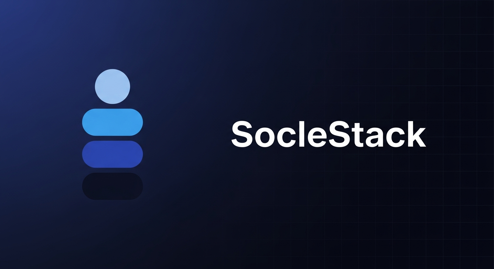

# SocleStack - Next.js User Management Application

<div align="center">
  
  <br />
</div>

> **Warning**
> **NOT PRODUCTION READY** - This project is under active development and has known security vulnerabilities and incomplete implementations. Do not deploy to production without addressing critical issues documented in the GitHub issues.

[](#known-limitations)
[](#known-limitations)



A complete Next.js 14 application with Enterprise-grade user management features, built with TypeScript, Prisma, and modern React components. "SocleStack" is the foundational block upon which your SaaS application is built.

## Features

- **Complete Authentication** - Registration, login, email verification, password reset, 2FA
- **Role-Based Access Control** - Hierarchical roles with database-driven permissions
- **Multi-Tenancy** - Organization-based data isolation with invite system
- **OAuth Integration** - Google and GitHub social login
- **API Keys** - Token-based API authentication with scoped permissions
- **Audit Logging** - Comprehensive security event tracking
- **Modern UI** - Responsive Tailwind CSS design with admin panel

## Tech Stack

Next.js 14 (App Router) | TypeScript | PostgreSQL + Prisma | Tailwind CSS | iron-session + JWT

## Quick Start

```bash
# Clone and install
git clone https://github.com/yourusername/soclestack.git
cd soclestack && npm install

# Start PostgreSQL
docker-compose up -d

# Setup environment and database
cp .env.example .env.local
npx prisma generate && npx prisma db push

# Run
npm run dev
```

Visit [http://localhost:3000](http://localhost:3000)

## Documentation

| Document | Description |
|----------|-------------|
| [API Reference](docs/API_REFERENCE.md) | Complete API endpoint documentation |
| [Technical Architecture](docs/TECHNICAL_ARCHITECTURE.md) | Project structure, security, and design |
| [Database Schema](docs/DATABASE.md) | Models, relationships, and queries |
| [Environment Variables](docs/ENVIRONMENT.md) | Configuration reference |
| [Migrations](docs/MIGRATIONS.md) | Database migration guide |
| [Troubleshooting](docs/TROUBLESHOOTING.md) | Common issues and solutions |

## Known Limitations

> **Warning**: The following issues must be addressed before production deployment.

### Security Status

| Issue | Status | Description |
|-------|--------|-------------|
| CSP Policy | Partial | `unsafe-inline` for styles (scripts use nonces in prod) |
| CSRF Protection | ✅ Fixed | Double-submit cookie pattern with middleware validation |
| Rate Limiting | Optional Redis | In-memory default; set `UPSTASH_REDIS_REST_URL` for Redis |
| Secrets Validation | ✅ Fixed | Zod validates all secrets, no hardcoded fallbacks |

### Production Checklist

- [ ] CSP `unsafe-inline` for styles addressed (nonce styles or external CSS)
- [ ] PostgreSQL configured and migrated
- [ ] Redis configured for rate limiting (`UPSTASH_REDIS_REST_URL`)
- [ ] Email service configured (Resend)
- [ ] All environment variables set (validated by Zod on startup)
- [ ] HTTPS enabled
- [ ] Security headers reviewed

See [TECHNICAL_ARCHITECTURE.md](docs/TECHNICAL_ARCHITECTURE.md) for full security considerations.

## Contributing

1. Fork the repository
2. Create your feature branch (`git checkout -b feature/amazing-feature`)
3. Commit your changes (`git commit -m 'Add some amazing feature'`)
4. Push to the branch (`git push origin feature/amazing-feature`)
5. Open a Pull Request

## License

MIT License - see [LICENSE](LICENSE) for details.
