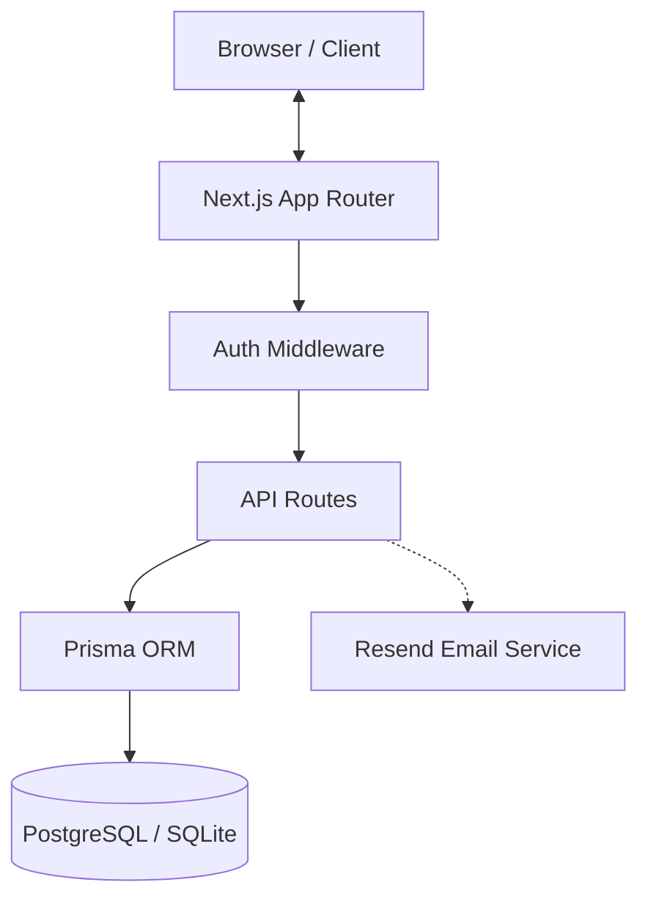
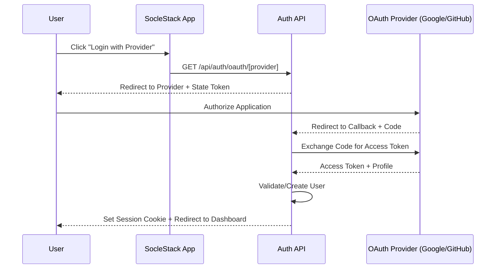

# Technical Architecture Document
## Next.js User Management System

### 1. Overview
This document outlines the technical architecture for a Next.js web application with comprehensive user management capabilities, inspired by established enterprise security patterns.



### 2. Technology Stack
- **Frontend Framework**: Next.js 15 with App Router
- **Language**: TypeScript
- **Database**: PostgreSQL with Prisma ORM
- **Authentication**: iron-session for session management, JWT for tokens
- **Styling**: Tailwind CSS
- **Validation**: Zod
- **State Management**: Server-first architecture (no client contexts)
- **Security**: bcrypt for password hashing, CSRF double-submit cookies
- **Rate Limiting**: In-memory or Redis (Upstash) backend

### 3. Project Structure
```
soclestack/
├── src/
│   ├── app/
│   │   ├── (auth)/
│   │   │   ├── login/
│   │   │   ├── register/
│   │   │   └── layout.tsx
│   │   ├── (dashboard)/
│   │   │   ├── profile/
│   │   │   ├── users/
│   │   │   └── layout.tsx
│   │   ├── api/
│   │   │   ├── auth/
│   │   │   │   ├── login/route.ts
│   │   │   │   ├── register/route.ts
│   │   │   │   ├── logout/route.ts
│   │   │   │   └── refresh/route.ts
│   │   │   └── users/
│   │   │       ├── route.ts
│   │   │       └── [id]/route.ts
│   │   ├── globals.css
│   │   ├── layout.tsx
│   │   └── page.tsx
│   ├── components/
│   │   ├── ui/
│   │   ├── forms/
│   │   ├── layouts/
│   │   └── auth/
│   ├── lib/
│   │   ├── auth.ts
│   │   ├── db.ts
│   │   ├── utils.ts
│   │   ├── validations.ts
│   │   └── security.ts
│   ├── contexts/
│   │   └── AuthContext.tsx
│   ├── types/
│   │   ├── auth.ts
│   │   └── user.ts
│   └── middleware.ts
├── prisma/
│   ├── schema.prisma
│   ├── migrations/
│   └── seed.ts
├── public/
├── package.json
├── tailwind.config.js
├── tsconfig.json
└── next.config.js
```

### 4. Database Schema Design

See `prisma/schema.prisma` for full schema. Key models:

#### User Model
```prisma
model User {
  id                       String    @id @default(cuid())
  email                    String    @unique
  username                 String?   @unique
  password                 String?   // Nullable for OAuth-only users
  firstName                String?   @map("first_name")
  lastName                 String?   @map("last_name")
  isActive                 Boolean   @default(true) @map("is_active")
  emailVerified            Boolean   @default(false) @map("email_verified")
  emailVerifiedAt          DateTime? @map("email_verified_at")
  lastLoginAt              DateTime? @map("last_login_at")

  // Account lockout
  failedLoginAttempts      Int       @default(0) @map("failed_login_attempts")
  lockedUntil              DateTime? @map("locked_until")

  // Two-factor authentication
  twoFactorSecret          String?   @map("two_factor_secret")
  twoFactorEnabled         Boolean   @default(false) @map("two_factor_enabled")
  twoFactorVerified        Boolean   @default(false) @map("two_factor_verified")

  // Relations
  sessions                 UserSession[]
  passwordHistory          PasswordHistory[]
  auditLogs                AuditLog[]
  backupCodes              BackupCode[]
  oauthAccounts            OAuthAccount[]
  apiKeys                  ApiKey[]
  userRoles                UserRole[]

  @@map("users")
}
```

#### UserSession Model
```prisma
model UserSession {
  id        String   @id @default(cuid())
  userId    String   @map("user_id")
  tokenHash String   @map("token_hash")
  expiresAt DateTime @map("expires_at")
  createdAt DateTime @default(now()) @map("created_at")
  ipAddress String?  @map("ip_address")
  userAgent String?  @map("user_agent")
  isActive  Boolean  @default(true) @map("is_active")

  user User @relation(fields: [userId], references: [id], onDelete: Cascade)

  @@index([userId])
  @@index([expiresAt])
  @@map("user_sessions")
}
```

#### Role Model (Hierarchical RBAC)
```prisma
model Role {
  id          String   @id @default(cuid())
  name        String   @unique  // "ROLE_USER", "ROLE_ADMIN", "ROLE_SUPER_ADMIN"
  description String?
  parentId    String?  @map("parent_id")  // Role hierarchy
  isSystem    Boolean  @default(false) @map("is_system")

  parent    Role?      @relation("RoleHierarchy", fields: [parentId], references: [id])
  children  Role[]     @relation("RoleHierarchy")
  userRoles UserRole[]

  @@map("roles")
}

model UserRole {
  id             String    @id @default(cuid())
  userId         String    @map("user_id")
  roleId         String    @map("role_id")
  organizationId String?   @map("organization_id")  // NULL = platform-wide role

  user         User          @relation(fields: [userId], references: [id], onDelete: Cascade)
  role         Role          @relation(fields: [roleId], references: [id], onDelete: Cascade)
  organization Organization? @relation(fields: [organizationId], references: [id], onDelete: Cascade)

  @@unique([userId, roleId, organizationId])
  @@map("user_roles")
}
```

### 5. Authentication Strategy

#### JWT Token Structure
```typescript
interface JWTPayload {
  sub: string; // user id
  email: string;
  role: string;
  iat: number;
  exp: number;
  jti: string; // unique token identifier
}
```

#### Token Management
- **Access Token**: Short-lived (15 minutes), stored in memory
- **Refresh Token**: Long-lived (7 days), stored in httpOnly cookie
- **Session Token**: Server-side session for critical operations

### 6. API Routes Structure

#### Authentication Endpoints
- `POST /api/auth/register` - User registration
- `POST /api/auth/login` - User login
- `POST /api/auth/logout` - User logout
- `POST /api/auth/refresh` - Token refresh
- `GET /api/auth/me` - Get current user

#### User Management Endpoints
- `GET /api/users` - List users (admin only)
- `GET /api/users/[id]` - Get user by ID
- `PUT /api/users/[id]` - Update user
- `DELETE /api/users/[id]` - Delete user (admin only)
- `POST /api/users/[id]/activate` - Activate user
- `POST /api/users/[id]/deactivate` - Deactivate user

### 7. State Management

#### AuthContext Structure
```typescript
interface AuthState {
  user: User | null;
  isLoading: boolean;
  isAuthenticated: boolean;
}

interface AuthActions {
  login: (credentials: LoginCredentials) => Promise<void>;
  logout: () => Promise<void>;
  register: (userData: RegisterData) => Promise<void>;
  refreshToken: () => Promise<void>;
  updateProfile: (data: Partial<User>) => Promise<void>;
}
```

### 8. Security Considerations

#### Password Security
- Minimum 8 characters, require uppercase, lowercase, number, special character
- bcrypt hashing with salt rounds of 12
- Password history to prevent reuse of last 5 passwords

#### Session Security
- HttpOnly cookies for refresh tokens
- CSRF protection with double-submit cookie pattern
- Session timeout and cleanup
- IP and User-Agent validation

#### Input Validation
- Zod schemas for all API inputs
- SQL injection prevention through Prisma ORM
- XSS protection with Content Security Policy
- Rate limiting on authentication endpoints

#### Route Protection
- Middleware for authentication checks
- Role-based access control (RBAC)
- API route protection with token validation

### 9. Error Handling Strategy

#### Error Types
```typescript
enum ErrorTypes {
  VALIDATION_ERROR = 'VALIDATION_ERROR',
  AUTHENTICATION_ERROR = 'AUTHENTICATION_ERROR',
  AUTHORIZATION_ERROR = 'AUTHORIZATION_ERROR',
  NOT_FOUND = 'NOT_FOUND',
  SERVER_ERROR = 'SERVER_ERROR'
}
```

#### Error Response Format
```typescript
interface ApiError {
  type: ErrorTypes;
  message: string;
  details?: Record<string, string[]>;
  timestamp: string;
  path: string;
}
```

### 10. Performance Considerations

- Database indexing on email, username, and user_id
- Redis caching for session data (optional)
- Pagination for user listings
- Lazy loading for user profiles
- Image optimization for avatars

### 11. Monitoring and Logging

- Request/response logging for API endpoints
- Authentication attempt logging
- Error tracking and alerting
- Performance monitoring for database queries
- Security event logging (failed logins, suspicious activity)

### 12. OAuth/Social Login Integration

#### Supported Providers
- **Google**: OAuth 2.0 with OpenID Connect
- **GitHub**: OAuth 2.0 authorization code flow

#### OAuthAccount Model
```prisma
model OAuthAccount {
  id                String    @id @default(cuid())
  userId            String    @map("user_id")
  user              User      @relation(fields: [userId], references: [id], onDelete: Cascade)
  provider          String    // "google" | "github"
  providerAccountId String    @map("provider_account_id")
  email             String?   // Email from OAuth provider
  accessToken       String?   @map("access_token")
  refreshToken      String?   @map("refresh_token")
  tokenExpiresAt    DateTime? @map("token_expires_at")
  createdAt         DateTime  @default(now()) @map("created_at")
  updatedAt         DateTime  @updatedAt @map("updated_at")

  @@unique([provider, providerAccountId])
  @@index([userId])
  @@map("oauth_accounts")
}
```

#### OAuth Flow Architecture



1. **Initiation**: `GET /api/auth/oauth/[provider]` - Generates state token, redirects to provider
2. **Callback**: `GET /api/auth/oauth/[provider]/callback` - Handles provider response
   - Existing user with linked OAuth: Sign in directly
   - Existing user by email (no OAuth): Redirect to `/auth/oauth/link` for password verification
   - New user: Redirect to `/auth/oauth/complete` for organization setup
3. **Registration**: `POST /api/auth/oauth/complete` - Creates user + organization or accepts invite
4. **Linking**: `POST /api/auth/oauth/link` - Links OAuth account after password verification

#### Security Measures
- **State Token**: JWT with nonce, provider, returnTo, inviteToken - prevents CSRF
- **Pending OAuth Token**: JWT containing OAuth profile data - expires in 15 minutes
- **Password Verification**: Required before linking OAuth to existing accounts
- **2FA Integration**: OAuth login respects 2FA requirement for linked accounts

#### OAuth Endpoints
- `GET /api/auth/oauth/[provider]` - Initiate OAuth flow
- `GET /api/auth/oauth/[provider]/callback` - OAuth callback handler
- `POST /api/auth/oauth/complete` - Complete OAuth registration
- `POST /api/auth/oauth/link` - Link OAuth account with password
- `GET /api/auth/oauth/accounts` - List user's linked OAuth accounts
- `DELETE /api/auth/oauth/accounts` - Unlink OAuth account

#### OAuth Libraries
```
src/lib/auth/oauth/
├── providers.ts     - Provider configurations (client IDs, scopes, URLs)
├── state.ts         - OAuth state token generation/verification (jose JWT)
├── client.ts        - OAuth HTTP client (authorization URL, token exchange, profile fetch)
├── pending-oauth.ts - Pending OAuth session tokens
└── index.ts         - Re-exports
```

### 13. Organizations (Multi-Tenancy)

#### Organization Models
```prisma
model Organization {
  id        String   @id @default(cuid())
  name      String
  slug      String   @unique
  createdAt DateTime @default(now()) @map("created_at")
  updatedAt DateTime @updatedAt @map("updated_at")

  userRoles UserRole[]
  invites   OrganizationInvite[]

  @@map("organizations")
}

model OrganizationInvite {
  id             String   @id @default(cuid())
  email          String
  roleId         String   @map("role_id")  // Role to assign when accepted
  token          String   @unique
  expiresAt      DateTime @map("expires_at")
  organizationId String   @map("organization_id")
  invitedById    String   @map("invited_by_id")
  createdAt      DateTime @default(now()) @map("created_at")

  organization Organization @relation(fields: [organizationId], references: [id], onDelete: Cascade)
  invitedBy    User         @relation(fields: [invitedById], references: [id])

  @@index([email])
  @@index([organizationId])
  @@map("organization_invites")
}
```

#### Organization Features
- Users belong to organizations via `UserRole` (see Section 4)
- Organization roles assigned through role system: ROLE_ORG_OWNER, ROLE_ORG_ADMIN, ROLE_ORG_MEMBER
- New users create organization during registration or accept invite
- Invite system with email and token-based acceptance (7-day expiry)
- Organization switching stored in session for users in multiple orgs
- Hierarchical role permissions within organization context

#### Organization Endpoints
- `GET /api/organizations` - List user's organizations
- `POST /api/organizations` - Create new organization
- `GET /api/organizations/current` - Get current organization
- `GET /api/organizations/current/members` - List organization members
- `POST /api/organizations/current/invites` - Create invite
- `DELETE /api/organizations/current/invites/[id]` - Cancel invite
- `GET /api/invites/[token]` - Get invite details
- `POST /api/invites/[token]/accept` - Accept invite

### 14. Two-Factor Authentication (2FA)

#### BackupCode Model
```prisma
model BackupCode {
  id        String    @id @default(cuid())
  userId    String    @map("user_id")
  user      User      @relation(fields: [userId], references: [id], onDelete: Cascade)
  codeHash  String    @map("code_hash")  // SHA-256 hash
  usedAt    DateTime? @map("used_at")
  createdAt DateTime  @default(now()) @map("created_at")

  @@index([userId])
  @@map("backup_codes")
}
```

#### 2FA Implementation
- **TOTP-based**: Uses `otpauth` library for RFC 6238 compliant TOTP
- **QR Code**: Generated via `qrcode` library for authenticator app scanning
- **Secret Storage**: Encrypted TOTP secret stored in `User.twoFactorSecret`
- **Backup Codes**: 10 single-use recovery codes (8 chars each, SHA-256 hashed)
- **Pending 2FA Token**: JWT containing user ID, expires in 5 minutes during login flow

#### 2FA User Fields
```prisma
// On User model
twoFactorSecret   String? @map("two_factor_secret")   // Encrypted TOTP secret
twoFactorEnabled  Boolean @default(false)             // 2FA is active
twoFactorVerified Boolean @default(false)             // Initial setup verified
```

#### 2FA Flow
1. **Setup**: User requests setup → Generate secret + QR code
2. **Verify**: User enters TOTP code → Validate and enable 2FA, generate backup codes
3. **Login**: Password valid + 2FA enabled → Return pending token → User enters TOTP → Complete login
4. **Recovery**: User can use backup code instead of TOTP (single-use)

#### 2FA Endpoints
- `POST /api/auth/2fa/setup` - Generate TOTP secret and QR code
- `POST /api/auth/2fa/verify` - Verify TOTP, enable 2FA, return backup codes
- `POST /api/auth/2fa/validate` - Validate TOTP or backup code during login
- `POST /api/auth/2fa/disable` - Disable 2FA (requires current TOTP)
- `POST /api/admin/users/[id]/reset-2fa` - Admin reset user's 2FA

#### 2FA Libraries
```
src/lib/auth/
├── totp.ts        - TOTP generation/verification (otpauth)
├── backup-codes.ts - Backup code generation/verification
└── pending-2fa.ts  - Pending 2FA JWT tokens (jose)
```

### 15. API Keys

#### ApiKey Model
```prisma
model ApiKey {
  id         String   @id @default(cuid())
  userId     String   @map("user_id")
  user       User     @relation(fields: [userId], references: [id], onDelete: Cascade)
  name       String   // User-friendly label
  keyHash    String   @map("key_hash")    // SHA-256 hash of the key
  keyPrefix  String   @map("key_prefix")  // First 8 chars for identification

  permission ApiKeyPermission @default(READ_ONLY)
  expiresAt  DateTime?        @map("expires_at")
  lastUsedAt DateTime?        @map("last_used_at")

  createdAt  DateTime  @default(now()) @map("created_at")
  revokedAt  DateTime? @map("revoked_at")  // Soft delete

  @@index([userId])
  @@index([keyHash])
  @@map("api_keys")
}

enum ApiKeyPermission {
  READ_ONLY
  READ_WRITE
}
```

#### API Key Features
- User-scoped keys for programmatic access
- Two permission levels: READ_ONLY (GET only) and READ_WRITE (all methods)
- Optional expiration date
- Maximum 10 keys per user
- Key shown only once at creation (stored as SHA-256 hash)
- Soft delete via `revokedAt` for audit trail
- `lastUsedAt` tracking for stale key identification

#### API Key Format
- Prefix: `ssk_` (soclestack key)
- Random: 32 bytes base64url encoded
- Example: `lsk_x7Kp2mNqR9vBc4wL8yF6hJ3sD5tG0aE1`

#### API Key Endpoints
- `POST /api/keys` - Create new API key (returns full key once)
- `GET /api/keys` - List user's API keys
- `GET /api/keys/[id]` - Get single key details
- `PATCH /api/keys/[id]` - Update key (name, permission, expiration)
- `DELETE /api/keys/[id]` - Revoke key (soft delete)

#### API Key Authentication
- Header: `Authorization: Bearer lsk_...`
- Keys respect user's active status and role permissions
- READ_ONLY keys reject non-GET/HEAD/OPTIONS requests with 403