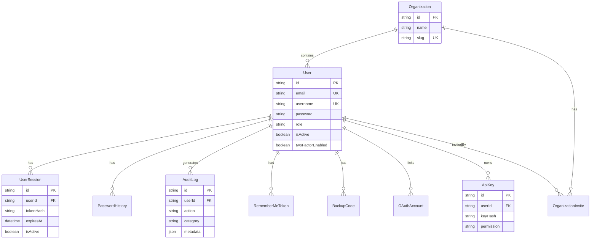

# Database Schema Documentation

**Status**: Current
**Last Updated**: 2026-01-01
**Database**: SQLite (development) / PostgreSQL (production)
**ORM**: Prisma 6.16.1

Complete reference for the SocleStack database schema, including all models, relationships, indexes, and usage patterns.

---

## Table of Contents

- [Overview](#overview)
- [Entity Relationship Diagram](#entity-relationship-diagram)
- [Models](#models)
  - [User](#user)
  - [UserSession](#usersession)
  - [PasswordHistory](#passwordhistory)
  - [AuditLog](#auditlog)
  - [RememberMeToken](#remembermetoken)
  - [BackupCode](#backupcode)
  - [Organization](#organization)
  - [OrganizationInvite](#organizationinvite)
  - [OAuthAccount](#oauthaccount)
  - [ApiKey](#apikey)
- [Enums](#enums)
- [Relationships](#relationships)
- [Indexes](#indexes)
- [Data Integrity](#data-integrity)
- [Performance Considerations](#performance-considerations)
- [Migration Guide](#migration-guide)
- [Common Queries](#common-queries)

---

## Overview

### Schema Statistics

| Metric | Count |
|--------|-------|
| **Total Models** | 10 |
| **Total Enums** | 3 |
| **Total Relations** | 11 |
| **Total Indexes** | 14 |
| **Cascade Deletes** | 7 |

### Database Providers

- **Development**: SQLite (file-based, zero-config)
- **Production**: PostgreSQL (recommended) or SQLite

### Key Features

- ✅ **Multi-tenancy**: Organization-based data isolation
- ✅ **Audit Trail**: Comprehensive security event logging
- ✅ **Two-Factor Auth**: TOTP + backup codes
- ✅ **OAuth Integration**: Google, GitHub providers
- ✅ **Session Management**: Multiple concurrent sessions + "Remember Me"
- ✅ **API Keys**: Token-based API authentication
- ✅ **Password Security**: History tracking, reset tokens
- ✅ **Account Security**: Lockout, failed login tracking

---

## Entity Relationship Diagram



---

## Models

### User

The central user model with authentication, authorization, and profile information.

**Table**: `users`

#### Fields

| Field | Type | Required | Default | Description |
|-------|------|----------|---------|-------------|
| `id` | String | Yes | `cuid()` | Primary key |
| `email` | String | Yes | - | Unique email address |
| `username` | String | No | - | Optional unique username |
| `password` | String | No | - | Hashed password (null for OAuth-only users) |
| `firstName` | String | No | - | User's first name |
| `lastName` | String | No | - | User's last name |
| `role` | Role | Yes | `USER` | System-wide role (USER, ADMIN, MODERATOR) |
| `isActive` | Boolean | Yes | `true` | Account active status |
| `emailVerified` | Boolean | Yes | `false` | Email verification status |
| `emailVerifiedAt` | DateTime | No | - | When email was verified |
| `lastLoginAt` | DateTime | No | - | Last successful login |
| `passwordResetToken` | String | No | - | Password reset token (hashed) |
| `passwordResetExpires` | DateTime | No | - | Reset token expiration |
| `passwordChangedAt` | DateTime | No | - | Last password change |
| `createdAt` | DateTime | Yes | `now()` | Account creation timestamp |
| `updatedAt` | DateTime | Yes | Auto | Last update timestamp |

#### Account Lockout Fields

| Field | Type | Required | Default | Description |
|-------|------|----------|---------|-------------|
| `failedLoginAttempts` | Int | Yes | `0` | Counter for failed logins |
| `lockedUntil` | DateTime | No | - | Account locked until this time |

**Lockout Logic**: After 5 failed attempts, account locked for 15 minutes.

#### Two-Factor Authentication Fields

| Field | Type | Required | Default | Description |
|-------|------|----------|---------|-------------|
| `twoFactorSecret` | String | No | - | TOTP secret (base32 encoded) |
| `twoFactorEnabled` | Boolean | Yes | `false` | 2FA enabled status |
| `twoFactorVerified` | Boolean | Yes | `false` | 2FA setup verification status |

#### Notification Preferences

| Field | Type | Required | Default | Description |
|-------|------|----------|---------|-------------|
| `notifyNewDevice` | Boolean | Yes | `true` | Email alert for new device login |
| `notifyPasswordChange` | Boolean | Yes | `true` | Email alert for password change |
| `notifyLoginAlert` | Boolean | Yes | `true` | Email alert for suspicious login |
| `notify2FAChange` | Boolean | Yes | `true` | Email alert for 2FA changes |

#### Organization Fields

| Field | Type | Required | Default | Description |
|-------|------|----------|---------|-------------|
| `organizationId` | String | No | - | FK to Organization |
| `organizationRole` | OrganizationRole | Yes | `MEMBER` | Role within organization |

#### Relations

- `organization`: Belongs to one Organization (optional)
- `sessions`: Has many UserSessions
- `passwordHistory`: Has many PasswordHistory records
- `auditLogs`: Has many AuditLogs
- `rememberMeTokens`: Has many RememberMeTokens
- `backupCodes`: Has many BackupCodes
- `sentInvites`: Has many OrganizationInvites (as inviter)
- `oauthAccounts`: Has many OAuthAccounts
- `apiKeys`: Has many ApiKeys

#### Indexes

- `email` (unique)
- `username` (unique)
- `organizationId` (for filtering by organization)

#### Usage Example

```typescript
// Create new user
const user = await prisma.user.create({
  data: {
    email: 'user@example.com',
    password: await hashPassword('SecurePassword123!'),
    firstName: 'John',
    lastName: 'Doe',
    role: 'USER',
  },
});

// Get user with all relations
const userWithRelations = await prisma.user.findUnique({
  where: { id: userId },
  include: {
    organization: true,
    sessions: { where: { isActive: true } },
    auditLogs: { take: 10, orderBy: { createdAt: 'desc' } },
    oauthAccounts: true,
  },
});

// Update notification preferences
await prisma.user.update({
  where: { id: userId },
  data: {
    notifyNewDevice: false,
    notifyLoginAlert: true,
  },
});
```

---

### UserSession

Tracks active user sessions with device and location information.

**Table**: `user_sessions`

#### Fields

| Field | Type | Required | Default | Description |
|-------|------|----------|---------|-------------|
| `id` | String | Yes | `cuid()` | Primary key |
| `userId` | String | Yes | - | FK to User |
| `tokenHash` | String | Yes | - | Hashed session token |
| `expiresAt` | DateTime | Yes | - | Session expiration |
| `createdAt` | DateTime | Yes | `now()` | Session creation |
| `ipAddress` | String | No | - | Client IP address |
| `userAgent` | String | No | - | Client user agent |
| `isActive` | Boolean | Yes | `true` | Session active status |

#### Relations

- `user`: Belongs to one User (cascade delete)

#### Usage Example

```typescript
// Create session
const session = await prisma.userSession.create({
  data: {
    userId: user.id,
    tokenHash: await hashSessionToken(token),
    expiresAt: new Date(Date.now() + 7 * 24 * 60 * 60 * 1000), // 7 days
    ipAddress: req.ip,
    userAgent: req.headers['user-agent'],
  },
});

// Get active sessions for user
const activeSessions = await prisma.userSession.findMany({
  where: {
    userId: user.id,
    isActive: true,
    expiresAt: { gt: new Date() },
  },
  orderBy: { createdAt: 'desc' },
});

// Revoke session
await prisma.userSession.update({
  where: { id: sessionId },
  data: { isActive: false },
});
```

---

### PasswordHistory

Tracks password changes to prevent password reuse.

**Table**: `password_history`

#### Fields

| Field | Type | Required | Default | Description |
|-------|------|----------|---------|-------------|
| `id` | String | Yes | `cuid()` | Primary key |
| `userId` | String | Yes | - | FK to User |
| `password` | String | Yes | - | Hashed password |
| `createdAt` | DateTime | Yes | `now()` | When password was set |

#### Relations

- `user`: Belongs to one User (cascade delete)

#### Usage Example

```typescript
// Store password in history
await prisma.passwordHistory.create({
  data: {
    userId: user.id,
    password: hashedPassword,
  },
});

// Check if password was used recently (prevent reuse)
const recentPasswords = await prisma.passwordHistory.findMany({
  where: { userId: user.id },
  orderBy: { createdAt: 'desc' },
  take: 5, // Check last 5 passwords
});

const isPasswordReused = await Promise.all(
  recentPasswords.map(async (ph) => await verifyPassword(newPassword, ph.password))
).then((results) => results.some((match) => match));
```

---

### AuditLog

Comprehensive security event logging for compliance and forensics.

**Table**: `audit_logs`

#### Fields

| Field | Type | Required | Default | Description |
|-------|------|----------|---------|-------------|
| `id` | String | Yes | `cuid()` | Primary key |
| `userId` | String | No | - | FK to User (null for system events) |
| `action` | String | Yes | - | Action performed (e.g., "login", "password_change") |
| `category` | String | Yes | - | Category (e.g., "auth", "user", "admin") |
| `ipAddress` | String | No | - | Client IP address |
| `userAgent` | String | No | - | Client user agent |
| `metadata` | String | No | - | JSON string with additional data |
| `createdAt` | DateTime | Yes | `now()` | When event occurred |

#### Relations

- `user`: Belongs to one User (optional, nullable)

#### Indexes

- `userId` (for user-specific logs)
- `action` (for filtering by action type)
- `createdAt` (for time-based queries)

#### Common Actions

| Action | Category | Description |
|--------|----------|-------------|
| `login` | `auth` | User logged in |
| `logout` | `auth` | User logged out |
| `login_failed` | `auth` | Failed login attempt |
| `password_change` | `auth` | Password changed |
| `account_locked` | `security` | Account locked due to failed attempts |
| `account_unlocked` | `security` | Account unlocked |
| `2fa_enabled` | `security` | 2FA enabled |
| `2fa_disabled` | `security` | 2FA disabled |
| `role_changed` | `admin` | User role changed |
| `user_created` | `user` | New user created |
| `user_deleted` | `user` | User deleted |

#### Usage Example

```typescript
// Log successful login
await prisma.auditLog.create({
  data: {
    userId: user.id,
    action: 'login',
    category: 'auth',
    ipAddress: req.ip,
    userAgent: req.headers['user-agent'],
    metadata: JSON.stringify({
      method: '2fa',
      newDevice: true,
    }),
  },
});

// Query audit logs for user
const userAuditLogs = await prisma.auditLog.findMany({
  where: {
    userId: user.id,
    category: 'security',
  },
  orderBy: { createdAt: 'desc' },
  take: 50,
});

// Export audit logs (admin)
const exportLogs = await prisma.auditLog.findMany({
  where: {
    createdAt: {
      gte: startDate,
      lte: endDate,
    },
  },
  include: { user: { select: { email: true } } },
});
```

---

### RememberMeToken

Implements "Remember Me" functionality with advanced token theft detection.

**Table**: `remember_me_tokens`

#### Fields

| Field | Type | Required | Default | Description |
|-------|------|----------|---------|-------------|
| `id` | String | Yes | `cuid()` | Primary key |
| `userId` | String | Yes | - | FK to User |
| `tokenHash` | String | Yes | - | Hashed token value |
| `series` | String | Yes | - | Token series identifier (unique) |
| `expiresAt` | DateTime | Yes | - | Token expiration (30 days) |
| `ipAddress` | String | No | - | Client IP address |
| `userAgent` | String | No | - | Client user agent |
| `lastUsedAt` | DateTime | Yes | `now()` | Last time token was used |
| `createdAt` | DateTime | Yes | `now()` | Token creation |

#### Relations

- `user`: Belongs to one User (cascade delete)

#### Indexes

- `userId` (for user's tokens)
- `series` (unique, for token lookup)
- `expiresAt` (for cleanup)

#### Token Theft Detection

The `series` field enables token theft detection:
1. Each "Remember Me" creates a unique series
2. Token is rotated on each use (new tokenHash, same series)
3. If an old token is reused → token theft detected → all series revoked

#### Usage Example

```typescript
// Create Remember Me token
const series = crypto.randomUUID();
const token = crypto.randomBytes(32).toString('base64');

await prisma.rememberMeToken.create({
  data: {
    userId: user.id,
    series,
    tokenHash: await hashToken(token),
    expiresAt: new Date(Date.now() + 30 * 24 * 60 * 60 * 1000), // 30 days
    ipAddress: req.ip,
    userAgent: req.headers['user-agent'],
  },
});

// Rotate token on use
await prisma.rememberMeToken.update({
  where: { series },
  data: {
    tokenHash: await hashToken(newToken),
    lastUsedAt: new Date(),
  },
});

// Revoke all user's Remember Me tokens
await prisma.rememberMeToken.deleteMany({
  where: { userId: user.id },
});
```

---

### BackupCode

Stores hashed 2FA backup codes for account recovery.

**Table**: `backup_codes`

#### Fields

| Field | Type | Required | Default | Description |
|-------|------|----------|---------|-------------|
| `id` | String | Yes | `cuid()` | Primary key |
| `userId` | String | Yes | - | FK to User |
| `codeHash` | String | Yes | - | Hashed backup code |
| `usedAt` | DateTime | No | - | When code was used (null if unused) |
| `createdAt` | DateTime | Yes | `now()` | Code generation timestamp |

#### Relations

- `user`: Belongs to one User (cascade delete)

#### Indexes

- `userId` (for user's codes)

#### Usage Example

```typescript
// Generate 10 backup codes
const codes = Array.from({ length: 10 }, () =>
  crypto.randomBytes(4).toString('hex')
);

await prisma.backupCode.createMany({
  data: codes.map((code) => ({
    userId: user.id,
    codeHash: hashCode(code),
  })),
});

// Use a backup code
const unusedCodes = await prisma.backupCode.findMany({
  where: {
    userId: user.id,
    usedAt: null,
  },
});

// Mark code as used
await prisma.backupCode.update({
  where: { id: matchedCode.id },
  data: { usedAt: new Date() },
});

// Count remaining backup codes
const remaining = await prisma.backupCode.count({
  where: {
    userId: user.id,
    usedAt: null,
  },
});
```

---

### Organization

Multi-tenant organization model for logical data isolation.

**Table**: `organizations`

#### Fields

| Field | Type | Required | Default | Description |
|-------|------|----------|---------|-------------|
| `id` | String | Yes | `cuid()` | Primary key |
| `name` | String | Yes | - | Organization name |
| `slug` | String | Yes | - | URL-safe unique identifier |
| `createdAt` | DateTime | Yes | `now()` | Creation timestamp |
| `updatedAt` | DateTime | Yes | Auto | Last update timestamp |

#### Relations

- `users`: Has many Users
- `invites`: Has many OrganizationInvites

#### Indexes

- `slug` (unique)

#### Usage Example

```typescript
// Create organization
const org = await prisma.organization.create({
  data: {
    name: 'Acme Corp',
    slug: 'acme-corp',
  },
});

// Get organization with members
const orgWithMembers = await prisma.organization.findUnique({
  where: { slug: 'acme-corp' },
  include: {
    users: {
      select: {
        id: true,
        email: true,
        organizationRole: true,
      },
    },
  },
});

// Check if slug is available
const exists = await prisma.organization.findUnique({
  where: { slug: 'acme-corp' },
});
```

---

### OrganizationInvite

Manages organization membership invitations.

**Table**: `organization_invites`

#### Fields

| Field | Type | Required | Default | Description |
|-------|------|----------|---------|-------------|
| `id` | String | Yes | `cuid()` | Primary key |
| `email` | String | Yes | - | Invitee email address |
| `role` | OrganizationRole | Yes | `MEMBER` | Role to assign upon acceptance |
| `token` | String | Yes | - | Unique invitation token |
| `expiresAt` | DateTime | Yes | - | Invitation expiration (7 days) |
| `organizationId` | String | Yes | - | FK to Organization |
| `invitedById` | String | Yes | - | FK to User (inviter) |
| `createdAt` | DateTime | Yes | `now()` | Invite creation |

#### Relations

- `organization`: Belongs to one Organization (cascade delete)
- `invitedBy`: Belongs to one User (the inviter)

#### Indexes

- `email` (for lookup)
- `token` (unique, for acceptance)
- `organizationId` (for organization's invites)

#### Usage Example

```typescript
// Create invitation
const invite = await prisma.organizationInvite.create({
  data: {
    email: 'newmember@example.com',
    role: 'MEMBER',
    token: crypto.randomUUID(),
    expiresAt: new Date(Date.now() + 7 * 24 * 60 * 60 * 1000), // 7 days
    organizationId: org.id,
    invitedById: currentUser.id,
  },
});

// Accept invitation
await prisma.$transaction(async (tx) => {
  // Add user to organization
  await tx.user.update({
    where: { id: user.id },
    data: {
      organizationId: invite.organizationId,
      organizationRole: invite.role,
    },
  });

  // Delete invitation
  await tx.organizationInvite.delete({
    where: { id: invite.id },
  });
});

// Cleanup expired invites
await prisma.organizationInvite.deleteMany({
  where: {
    expiresAt: { lt: new Date() },
  },
});
```

---

### OAuthAccount

Links user accounts to OAuth providers (Google, GitHub).

**Table**: `oauth_accounts`

#### Fields

| Field | Type | Required | Default | Description |
|-------|------|----------|---------|-------------|
| `id` | String | Yes | `cuid()` | Primary key |
| `userId` | String | Yes | - | FK to User |
| `provider` | String | Yes | - | Provider name ("google", "github") |
| `providerAccountId` | String | Yes | - | User ID from provider |
| `email` | String | No | - | Email from OAuth provider |
| `accessToken` | String | No | - | OAuth access token |
| `refreshToken` | String | No | - | OAuth refresh token |
| `tokenExpiresAt` | DateTime | No | - | Access token expiration |
| `createdAt` | DateTime | Yes | `now()` | Account link timestamp |
| `updatedAt` | DateTime | Yes | Auto | Last update |

#### Relations

- `user`: Belongs to one User (cascade delete)

#### Indexes

- `userId` (for user's OAuth accounts)
- `[provider, providerAccountId]` (unique composite)

#### Usage Example

```typescript
// Link OAuth account
const oauthAccount = await prisma.oAuthAccount.create({
  data: {
    userId: user.id,
    provider: 'google',
    providerAccountId: googleUser.id,
    email: googleUser.email,
    accessToken: tokens.access_token,
    refreshToken: tokens.refresh_token,
    tokenExpiresAt: new Date(Date.now() + tokens.expires_in * 1000),
  },
});

// Find user by OAuth provider
const user = await prisma.user.findFirst({
  where: {
    oauthAccounts: {
      some: {
        provider: 'google',
        providerAccountId: googleUserId,
      },
    },
  },
});

// Unlink OAuth account
await prisma.oAuthAccount.delete({
  where: {
    provider_providerAccountId: {
      provider: 'google',
      providerAccountId: googleUserId,
    },
  },
});
```

---

### ApiKey

Token-based API authentication for programmatic access.

**Table**: `api_keys`

#### Fields

| Field | Type | Required | Default | Description |
|-------|------|----------|---------|-------------|
| `id` | String | Yes | `cuid()` | Primary key |
| `userId` | String | Yes | - | FK to User (key owner) |
| `name` | String | Yes | - | User-friendly label |
| `keyHash` | String | Yes | - | SHA-256 hash of API key |
| `keyPrefix` | String | Yes | - | First 8 chars (for identification) |
| `permission` | ApiKeyPermission | Yes | `READ_ONLY` | Access level |
| `expiresAt` | DateTime | No | - | Optional expiration |
| `lastUsedAt` | DateTime | No | - | Last usage timestamp |
| `createdAt` | DateTime | Yes | `now()` | Key creation |
| `revokedAt` | DateTime | No | - | Soft delete timestamp |

#### Relations

- `user`: Belongs to one User (cascade delete)

#### Indexes

- `userId` (for user's keys)
- `keyHash` (for authentication lookup)

#### Usage Example

```typescript
// Generate API key
const apiKey = `sk_${crypto.randomBytes(32).toString('base64url')}`;
const keyHash = crypto.createHash('sha256').update(apiKey).digest('hex');

await prisma.apiKey.create({
  data: {
    userId: user.id,
    name: 'Production API Key',
    keyHash,
    keyPrefix: apiKey.substring(0, 8),
    permission: 'READ_WRITE',
    expiresAt: new Date(Date.now() + 365 * 24 * 60 * 60 * 1000), // 1 year
  },
});

// Authenticate with API key
const keyHash = crypto.createHash('sha256').update(providedKey).digest('hex');

const apiKey = await prisma.apiKey.findFirst({
  where: {
    keyHash,
    revokedAt: null,
    OR: [
      { expiresAt: null },
      { expiresAt: { gt: new Date() } },
    ],
  },
  include: { user: true },
});

// Revoke API key (soft delete)
await prisma.apiKey.update({
  where: { id: keyId },
  data: { revokedAt: new Date() },
});
```

---

## Enums

### Role

System-wide user roles for global permissions.

```prisma
enum Role {
  USER       // Standard user
  ADMIN      // Full system access
  MODERATOR  // Content moderation
}
```

**Permissions**:
- `USER`: Basic app access
- `MODERATOR`: User management, content moderation
- `ADMIN`: Full system access, user impersonation, audit logs

### OrganizationRole

Organization-specific roles for multi-tenant access control.

```prisma
enum OrganizationRole {
  OWNER   // Full control, can delete organization
  ADMIN   // Manage users, settings
  MEMBER  // Basic access
}
```

**Permissions**:
- `MEMBER`: View organization data
- `ADMIN`: Invite members, change settings
- `OWNER`: Delete organization, manage admins

### ApiKeyPermission

API key access levels.

```prisma
enum ApiKeyPermission {
  READ_ONLY   // GET requests only
  READ_WRITE  // Full CRUD access
}
```

---

## Relationships

### One-to-Many

| Parent | Child | Delete Behavior |
|--------|-------|-----------------|
| User | UserSession | CASCADE |
| User | PasswordHistory | CASCADE |
| User | AuditLog | SET NULL |
| User | RememberMeToken | CASCADE |
| User | BackupCode | CASCADE |
| User | OrganizationInvite | RESTRICT |
| User | OAuthAccount | CASCADE |
| User | ApiKey | CASCADE |
| Organization | User | SET NULL |
| Organization | OrganizationInvite | CASCADE |

### Foreign Keys

All foreign keys use `@relation` with appropriate `onDelete` behavior:
- `Cascade`: Child deleted when parent deleted
- `SetNull`: Child's FK set to null when parent deleted
- `Restrict`: Prevents parent deletion if children exist

---

## Indexes

### Performance Indexes

| Table | Index | Purpose |
|-------|-------|---------|
| `users` | `email` | Login lookup |
| `users` | `username` | Username lookup |
| `users` | `organizationId` | Filter by organization |
| `audit_logs` | `userId` | User activity logs |
| `audit_logs` | `action` | Filter by action type |
| `audit_logs` | `createdAt` | Time-based queries |
| `remember_me_tokens` | `userId` | User's tokens |
| `remember_me_tokens` | `series` | Token lookup |
| `remember_me_tokens` | `expiresAt` | Cleanup expired tokens |
| `backup_codes` | `userId` | User's codes |
| `organization_invites` | `email` | Invite lookup |
| `organization_invites` | `organizationId` | Org's invites |
| `oauth_accounts` | `userId` | User's OAuth accounts |
| `api_keys` | `userId` | User's API keys |
| `api_keys` | `keyHash` | API key authentication |

### Unique Constraints

| Table | Field(s) | Purpose |
|-------|----------|---------|
| `users` | `email` | Prevent duplicate emails |
| `users` | `username` | Prevent duplicate usernames |
| `organizations` | `slug` | Unique organization URLs |
| `remember_me_tokens` | `series` | Token series uniqueness |
| `organization_invites` | `token` | Unique invite tokens |
| `oauth_accounts` | `[provider, providerAccountId]` | One OAuth account per provider per user |

---

## Data Integrity

### Validation Rules

1. **Email addresses**: Must be unique, valid format
2. **Passwords**: Hashed with bcrypt (12 rounds), nullable for OAuth users
3. **Tokens**: Hashed before storage, never stored in plain text
4. **Dates**: Use UTC timestamps, validated for logical order
5. **Enums**: Validated against allowed values

### Cascade Deletes

When a User is deleted:
- ✅ All UserSessions deleted
- ✅ All PasswordHistory deleted
- ✅ All RememberMeTokens deleted
- ✅ All BackupCodes deleted
- ✅ All OAuthAccounts deleted
- ✅ All ApiKeys deleted
- ⚠️ AuditLogs preserved (userId set to null)
- ⚠️ OrganizationInvites preserved (invitedById NOT nullable)

When an Organization is deleted:
- ✅ All OrganizationInvites deleted
- ⚠️ Users have organizationId set to null

### Soft Deletes

- **ApiKey**: Uses `revokedAt` timestamp instead of hard delete
- Allows audit trail and potential key restoration

---

## Performance Considerations

### Query Optimization

**DO:**
```typescript
// Use indexes
await prisma.user.findUnique({ where: { email } }); // Uses email index

// Select only needed fields
await prisma.user.findMany({
  select: { id: true, email: true, role: true },
});

// Paginate large result sets
await prisma.auditLog.findMany({
  take: 50,
  skip: page * 50,
  orderBy: { createdAt: 'desc' },
});
```

**DON'T:**
```typescript
// Avoid N+1 queries
for (const user of users) {
  const sessions = await prisma.userSession.findMany({ where: { userId: user.id } });
}

// Use include instead
const users = await prisma.user.findMany({
  include: { sessions: true },
});
```

### Cleanup Jobs

Recommended periodic cleanup:

```typescript
// Delete expired sessions
await prisma.userSession.deleteMany({
  where: { expiresAt: { lt: new Date() } },
});

// Delete expired Remember Me tokens
await prisma.rememberMeToken.deleteMany({
  where: { expiresAt: { lt: new Date() } },
});

// Delete expired invitations
await prisma.organizationInvite.deleteMany({
  where: { expiresAt: { lt: new Date() } },
});

// Delete old audit logs (retention: 90 days)
await prisma.auditLog.deleteMany({
  where: {
    createdAt: { lt: new Date(Date.now() - 90 * 24 * 60 * 60 * 1000) },
  },
});
```

---

## Migration Guide

See [MIGRATIONS.md](./MIGRATIONS.md) for detailed migration instructions.

**Quick Reference**:

```bash
# Generate migration
npx prisma migrate dev --name add_api_keys

# Apply migrations (development)
npx prisma migrate dev

# Apply migrations (production)
npx prisma migrate deploy

# Reset database (development only)
npx prisma migrate reset

# View migration status
npx prisma migrate status
```

---

## Common Queries

### Authentication

```typescript
// Find user by email for login
const user = await prisma.user.findUnique({
  where: { email },
  include: {
    organization: true,
    backupCodes: { where: { usedAt: null } },
  },
});

// Check if user is locked out
const isLocked = user.lockedUntil && user.lockedUntil > new Date();

// Increment failed login attempts
await prisma.user.update({
  where: { id: user.id },
  data: {
    failedLoginAttempts: { increment: 1 },
    ...(user.failedLoginAttempts + 1 >= 5 && {
      lockedUntil: new Date(Date.now() + 15 * 60 * 1000), // 15 min
    }),
  },
});
```

### Organization Management

```typescript
// Get all organization members with roles
const members = await prisma.user.findMany({
  where: { organizationId: orgId },
  select: {
    id: true,
    email: true,
    firstName: true,
    lastName: true,
    organizationRole: true,
    createdAt: true,
  },
  orderBy: { createdAt: 'desc' },
});

// Transfer organization ownership
await prisma.$transaction([
  prisma.user.update({
    where: { id: currentOwnerId },
    data: { organizationRole: 'ADMIN' },
  }),
  prisma.user.update({
    where: { id: newOwnerId },
    data: { organizationRole: 'OWNER' },
  }),
]);
```

### Audit & Security

```typescript
// Get user's recent security events
const securityEvents = await prisma.auditLog.findMany({
  where: {
    userId: user.id,
    category: 'security',
  },
  orderBy: { createdAt: 'desc' },
  take: 20,
});

// Suspicious login detection
const recentFailures = await prisma.auditLog.count({
  where: {
    userId: user.id,
    action: 'login_failed',
    createdAt: { gte: new Date(Date.now() - 60 * 60 * 1000) }, // Last hour
  },
});
```

---

## Related Documentation

- [Environment Variables](./ENVIRONMENT.md) - Database connection configuration
- [Migrations Guide](./MIGRATIONS.md) - Database migration workflow
- [API Documentation](./API.md) - API endpoints using these models
- [Security Guidelines](../SECURITY.md) - Security best practices

---

## Changelog

- **2026-01-01**: Initial comprehensive database schema documentation
  - Documented all 10 models with complete field reference
  - Added ER diagram and relationship documentation
  - Included usage examples for common queries
  - Documented indexes and performance considerations
  - Added data integrity and validation rules
