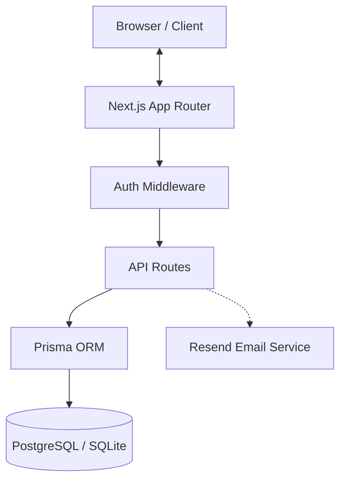
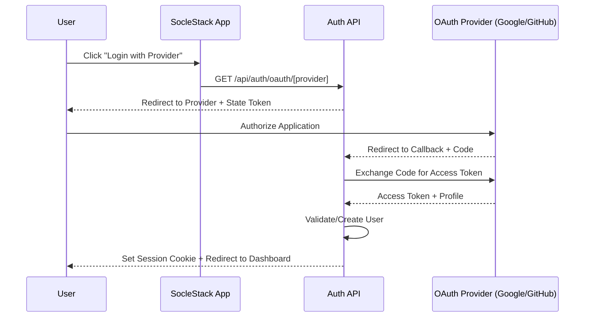
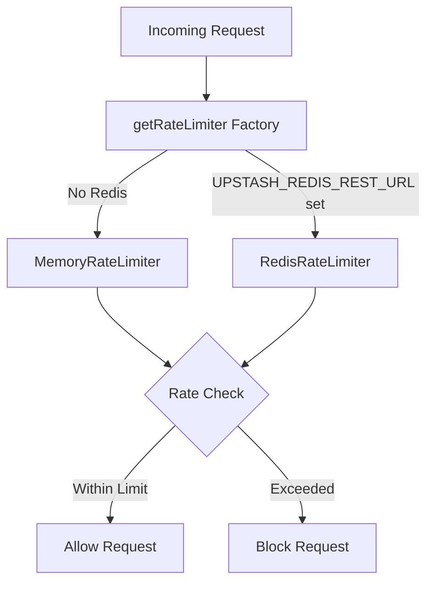

# Technical Architecture Document
## Next.js User Management System

### 1. Overview
This document outlines the technical architecture for a Next.js web application with comprehensive user management capabilities, inspired by established enterprise security patterns.



### 2. Technology Stack
- **Frontend Framework**: Next.js 14+ with App Router
- **Language**: TypeScript
- **Database**: PostgreSQL with Prisma ORM
- **Authentication**: Custom JWT implementation with NextAuth.js fallback
- **Styling**: Tailwind CSS
- **Validation**: Zod
- **State Management**: React Context + useReducer for user state
- **Security**: bcrypt for password hashing, iron-session for session management

### 3. Project Structure
```
soclestack/
├── src/
│   ├── app/
│   │   ├── (auth)/
│   │   │   ├── login/
│   │   │   ├── register/
│   │   │   └── layout.tsx
│   │   ├── (dashboard)/
│   │   │   ├── profile/
│   │   │   ├── users/
│   │   │   └── layout.tsx
│   │   ├── api/
│   │   │   ├── auth/
│   │   │   │   ├── login/route.ts
│   │   │   │   ├── register/route.ts
│   │   │   │   ├── logout/route.ts
│   │   │   │   └── refresh/route.ts
│   │   │   └── users/
│   │   │       ├── route.ts
│   │   │       └── [id]/route.ts
│   │   ├── globals.css
│   │   ├── layout.tsx
│   │   └── page.tsx
│   ├── components/
│   │   ├── ui/
│   │   ├── forms/
│   │   ├── layouts/
│   │   └── auth/
│   ├── lib/
│   │   ├── auth.ts
│   │   ├── db.ts
│   │   ├── utils.ts
│   │   ├── validations.ts
│   │   └── security.ts
│   ├── contexts/
│   │   └── AuthContext.tsx
│   ├── types/
│   │   ├── auth.ts
│   │   └── user.ts
│   └── middleware.ts
├── prisma/
│   ├── schema.prisma
│   ├── migrations/
│   └── seed.ts
├── public/
├── package.json
├── tailwind.config.js
├── tsconfig.json
└── next.config.js
```

### 4. Database Schema Design

#### Users Table
```sql
CREATE TABLE users (
  id SERIAL PRIMARY KEY,
  email VARCHAR(255) UNIQUE NOT NULL,
  username VARCHAR(100) UNIQUE,
  password VARCHAR(255) NOT NULL,
  first_name VARCHAR(100),
  last_name VARCHAR(100),
  role VARCHAR(50) DEFAULT 'user',
  is_active BOOLEAN DEFAULT true,
  email_verified_at TIMESTAMP NULL,
  created_at TIMESTAMP DEFAULT CURRENT_TIMESTAMP,
  updated_at TIMESTAMP DEFAULT CURRENT_TIMESTAMP,
  last_login_at TIMESTAMP NULL
);
```

#### User Sessions Table
```sql
CREATE TABLE user_sessions (
  id SERIAL PRIMARY KEY,
  user_id INTEGER REFERENCES users(id) ON DELETE CASCADE,
  token_hash VARCHAR(255) NOT NULL,
  expires_at TIMESTAMP NOT NULL,
  created_at TIMESTAMP DEFAULT CURRENT_TIMESTAMP,
  ip_address INET,
  user_agent TEXT
);
```

### 5. Authentication Strategy

#### JWT Token Structure
```typescript
interface JWTPayload {
  sub: string; // user id
  email: string;
  role: string;
  iat: number;
  exp: number;
  jti: string; // unique token identifier
}
```

#### Token Management
- **Access Token**: Short-lived (15 minutes), stored in memory
- **Refresh Token**: Long-lived (7 days), stored in httpOnly cookie
- **Session Token**: Server-side session for critical operations

### 6. API Routes Structure

#### Authentication Endpoints
- `POST /api/auth/register` - User registration
- `POST /api/auth/login` - User login
- `POST /api/auth/logout` - User logout
- `POST /api/auth/refresh` - Token refresh
- `GET /api/auth/me` - Get current user

#### User Management Endpoints
- `GET /api/users` - List users (admin only)
- `GET /api/users/[id]` - Get user by ID
- `PUT /api/users/[id]` - Update user
- `DELETE /api/users/[id]` - Delete user (admin only)
- `POST /api/users/[id]/activate` - Activate user
- `POST /api/users/[id]/deactivate` - Deactivate user

### 7. State Management

#### AuthContext Structure
```typescript
interface AuthState {
  user: User | null;
  isLoading: boolean;
  isAuthenticated: boolean;
}

interface AuthActions {
  login: (credentials: LoginCredentials) => Promise<void>;
  logout: () => Promise<void>;
  register: (userData: RegisterData) => Promise<void>;
  refreshToken: () => Promise<void>;
  updateProfile: (data: Partial<User>) => Promise<void>;
}
```

### 8. Security Considerations

#### Password Security
- Minimum 8 characters, require uppercase, lowercase, number, special character
- bcrypt hashing with salt rounds of 12
- Password history to prevent reuse of last 5 passwords

#### Session Security
- HttpOnly cookies for refresh tokens
- CSRF protection with double-submit cookie pattern
- Session timeout and cleanup
- IP and User-Agent validation

#### Input Validation
- Zod schemas for all API inputs
- SQL injection prevention through Prisma ORM
- XSS protection with Content Security Policy
- Rate limiting on authentication endpoints

#### Route Protection
- Middleware for authentication checks
- Role-based access control (RBAC)
- API route protection with token validation

#### RBAC System (Symfony-style)
- **Hierarchical roles**: Roles inherit permissions from parent roles
- **Database-driven**: New roles can be created without code changes
- **Role pattern**: `ROLE_[A-Z][A-Z0-9_]+` (minimum 2 chars after ROLE_ prefix)
- **Authorization**: `isGranted(user, 'ROLE_ADMIN')` checks role hierarchy from database
- **Voters**: Support contextual authorization (e.g., organization-level permissions)

**Creating Custom Roles:**

```typescript
import { isPlatformRole } from '@/lib/security';
import { prisma } from '@/lib/db';

// 1. Validate and normalize role name format
const userInput = "billing_admin";
const roleName = `ROLE_${userInput.trim().toUpperCase()}`;

if (!isPlatformRole(roleName)) {
  throw new Error(
    'Role name must follow pattern ROLE_[A-Z][A-Z0-9_]+ (minimum 2 characters after ROLE_ prefix)'
  );
}

// 2. Create role in database
const newRole = await prisma.role.create({
  data: {
    name: roleName, // "ROLE_BILLING_ADMIN"
    description: "Manages billing and invoices",
    parentId: adminRoleId // Optional: inherit from ROLE_ADMIN
  }
});

// 3. Use in authorization checks
const user = await getCurrentUser();
if (await isGranted(user, 'ROLE_BILLING_ADMIN')) {
  // User has this role or inherits it from a parent role
}
```

**Valid Role Examples:**
- `ROLE_USER`, `ROLE_ADMIN`, `ROLE_MODERATOR` (base roles)
- `ROLE_BILLING_ADMIN`, `ROLE_SUPPORT_TIER_1` (custom roles)
- `ROLE_API_READ_ONLY`, `ROLE_ORG_OWNER` (specialized roles)

**Invalid Role Examples:**
- `ROLE_A` (too short, minimum 2 chars)
- `admin` (missing ROLE_ prefix)
- `ROLE_admin` (lowercase not allowed)
- `ROLE-ADMIN` (hyphen not allowed, use underscore)

See [Arbitrary Role Support Spike](./spikes/2026-01-04-jwt-arbitrary-roles.md) for detailed architecture.

### 9. Error Handling Strategy

#### Error Types
```typescript
enum ErrorTypes {
  VALIDATION_ERROR = 'VALIDATION_ERROR',
  AUTHENTICATION_ERROR = 'AUTHENTICATION_ERROR',
  AUTHORIZATION_ERROR = 'AUTHORIZATION_ERROR',
  NOT_FOUND = 'NOT_FOUND',
  SERVER_ERROR = 'SERVER_ERROR'
}
```

#### Error Response Format
```typescript
interface ApiError {
  type: ErrorTypes;
  message: string;
  details?: Record<string, string[]>;
  timestamp: string;
  path: string;
}
```

### 10. Performance Considerations

- Database indexing on email, username, and user_id
- Redis caching for session data (optional)
- Pagination for user listings
- Lazy loading for user profiles
- Image optimization for avatars

### 11. Monitoring and Logging

- Request/response logging for API endpoints
- Authentication attempt logging
- Error tracking and alerting
- Performance monitoring for database queries
- Security event logging (failed logins, suspicious activity)

### 12. OAuth/Social Login Integration

#### Supported Providers
- **Google**: OAuth 2.0 with OpenID Connect
- **GitHub**: OAuth 2.0 authorization code flow

#### OAuth Database Schema
```sql
CREATE TABLE oauth_accounts (
  id TEXT PRIMARY KEY,
  user_id TEXT REFERENCES users(id) ON DELETE CASCADE,
  provider TEXT NOT NULL, -- 'google' | 'github'
  provider_account_id TEXT NOT NULL,
  email TEXT,
  access_token TEXT,
  refresh_token TEXT,
  token_expires_at TIMESTAMP,
  created_at TIMESTAMP DEFAULT CURRENT_TIMESTAMP,
  updated_at TIMESTAMP DEFAULT CURRENT_TIMESTAMP,
  UNIQUE(provider, provider_account_id)
);
```

#### OAuth Flow Architecture



1. **Initiation**: `GET /api/auth/oauth/[provider]` - Generates state token, redirects to provider
2. **Callback**: `GET /api/auth/oauth/[provider]/callback` - Handles provider response
   - Existing user with linked OAuth: Sign in directly
   - Existing user by email (no OAuth): Redirect to `/auth/oauth/link` for password verification
   - New user: Redirect to `/auth/oauth/complete` for organization setup
3. **Registration**: `POST /api/auth/oauth/complete` - Creates user + organization or accepts invite
4. **Linking**: `POST /api/auth/oauth/link` - Links OAuth account after password verification

#### Security Measures
- **State Token**: JWT with nonce, provider, returnTo, inviteToken - prevents CSRF
- **Pending OAuth Token**: JWT containing OAuth profile data - expires in 15 minutes
- **Password Verification**: Required before linking OAuth to existing accounts
- **2FA Integration**: OAuth login respects 2FA requirement for linked accounts

#### OAuth Endpoints
- `GET /api/auth/oauth/[provider]` - Initiate OAuth flow
- `GET /api/auth/oauth/[provider]/callback` - OAuth callback handler
- `POST /api/auth/oauth/complete` - Complete OAuth registration
- `POST /api/auth/oauth/link` - Link OAuth account with password
- `GET /api/auth/oauth/accounts` - List user's linked OAuth accounts
- `DELETE /api/auth/oauth/accounts` - Unlink OAuth account

#### OAuth Libraries
```
src/lib/auth/oauth/
├── providers.ts     - Provider configurations (client IDs, scopes, URLs)
├── state.ts         - OAuth state token generation/verification (jose JWT)
├── client.ts        - OAuth HTTP client (authorization URL, token exchange, profile fetch)
├── pending-oauth.ts - Pending OAuth session tokens
└── index.ts         - Re-exports
```

### 13. Organizations (Multi-Tenancy)

#### Organization Database Schema
```sql
CREATE TABLE organizations (
  id TEXT PRIMARY KEY,
  name TEXT NOT NULL,
  slug TEXT UNIQUE NOT NULL,
  owner_id TEXT REFERENCES users(id),
  created_at TIMESTAMP DEFAULT CURRENT_TIMESTAMP,
  updated_at TIMESTAMP DEFAULT CURRENT_TIMESTAMP
);

CREATE TABLE organization_members (
  id TEXT PRIMARY KEY,
  organization_id TEXT REFERENCES organizations(id) ON DELETE CASCADE,
  user_id TEXT REFERENCES users(id) ON DELETE CASCADE,
  role TEXT NOT NULL, -- 'owner' | 'admin' | 'member'
  joined_at TIMESTAMP DEFAULT CURRENT_TIMESTAMP,
  UNIQUE(organization_id, user_id)
);

CREATE TABLE organization_invites (
  id TEXT PRIMARY KEY,
  organization_id TEXT REFERENCES organizations(id) ON DELETE CASCADE,
  email TEXT NOT NULL,
  role TEXT NOT NULL,
  token TEXT UNIQUE NOT NULL,
  invited_by_id TEXT REFERENCES users(id),
  expires_at TIMESTAMP NOT NULL,
  accepted_at TIMESTAMP,
  created_at TIMESTAMP DEFAULT CURRENT_TIMESTAMP
);
```

#### Organization Features
- Users must belong to at least one organization
- New users create organization during registration or accept invite
- Organization roles: owner, admin, member
- Invite system with email and token-based acceptance
- Organization switching (for users in multiple orgs)

### 14. Two-Factor Authentication (2FA)

#### 2FA Implementation
- TOTP-based 2FA using authenticator apps
- QR code generation for easy setup
- 10 backup codes for recovery
- Admin can reset user's 2FA
- Required for ADMIN role, optional for others

#### 2FA Endpoints
- `POST /api/auth/2fa/setup` - Generate TOTP secret and QR code
- `POST /api/auth/2fa/verify` - Verify TOTP and enable 2FA
- `POST /api/auth/2fa/validate` - Validate 2FA during login
- `POST /api/auth/2fa/disable` - Disable 2FA (requires verification)
- `POST /api/admin/users/[id]/reset-2fa` - Admin reset user's 2FA

### 15. API Keys

#### API Key Database Schema
```sql
CREATE TABLE api_keys (
  id TEXT PRIMARY KEY,
  user_id TEXT REFERENCES users(id) ON DELETE CASCADE,
  name TEXT NOT NULL,
  key_hash TEXT NOT NULL,
  key_prefix TEXT NOT NULL,
  permission TEXT NOT NULL, -- 'READ_ONLY' | 'READ_WRITE'
  expires_at TIMESTAMP,
  last_used_at TIMESTAMP,
  created_at TIMESTAMP DEFAULT CURRENT_TIMESTAMP,
  revoked_at TIMESTAMP -- Soft delete
);
```

#### API Key Features
- User-scoped keys for programmatic access
- Two permission levels: READ_ONLY (GET only) and READ_WRITE (all methods)
- Optional expiration date
- Maximum 10 keys per user
- Key shown only once at creation (stored as SHA-256 hash)
- Soft delete via `revokedAt` for audit trail
- `lastUsedAt` tracking for stale key identification

#### API Key Format
- Prefix: `ssk_` (soclestack key)
- Random: 32 bytes base64url encoded
- Example: `lsk_x7Kp2mNqR9vBc4wL8yF6hJ3sD5tG0aE1`

#### API Key Endpoints
- `POST /api/keys` - Create new API key (returns full key once)
- `GET /api/keys` - List user's API keys
- `GET /api/keys/[id]` - Get single key details
- `PATCH /api/keys/[id]` - Update key (name, permission, expiration)
- `DELETE /api/keys/[id]` - Revoke key (soft delete)

#### API Key Authentication
- Header: `Authorization: Bearer lsk_...`
- Keys respect user's active status and role permissions
- READ_ONLY keys reject non-GET/HEAD/OPTIONS requests with 403

### 16. Rate Limiting Abstraction

#### Architecture
The rate limiter uses a pluggable backend pattern with two implementations:



#### Interface
```typescript
interface RateLimiter {
  check(key: string, limit: number, windowMs: number): Promise<RateLimitResult>;
  peek(key: string, limit: number, windowMs: number): Promise<RateLimitResult>;
  reset(key: string): Promise<void>;
  shutdown(): Promise<void>;
}

interface RateLimitResult {
  limited: boolean;
  headers: RateLimitHeaders;
}

interface RateLimitHeaders {
  'X-RateLimit-Limit': number;
  'X-RateLimit-Remaining': number;
  'X-RateLimit-Reset': number;
  'Retry-After'?: number;
}
```

#### Implementations

**MemoryRateLimiter** (`src/lib/rate-limiter/memory.ts`)
- In-memory Map-based storage
- Automatic cleanup of expired entries (configurable interval)
- Suitable for single-instance deployments

**RedisRateLimiter** (`src/lib/rate-limiter/redis.ts`)
- Upstash Redis HTTP-based client
- Atomic Lua script for INCR + EXPIRE operations
- Suitable for horizontally scaled deployments
- Fails open (allows request) on Redis errors

#### Factory Pattern
```typescript
// Auto-selects Redis if UPSTASH_REDIS_REST_URL is configured
const rateLimiter = getRateLimiter();
```

#### Rate Limit Headers (RFC Compliant)
- `X-RateLimit-Limit`: Maximum requests allowed
- `X-RateLimit-Remaining`: Requests remaining in window
- `X-RateLimit-Reset`: Unix timestamp when window resets
- `Retry-After`: Seconds to wait (only when limited)

### 17. Structured Logging

#### Logger Architecture
Structured logging using Pino with JSON output format.

```typescript
// src/lib/logger.ts
export const log = {
  debug: (message: string, meta?: object) => void;
  info: (message: string, meta?: object) => void;
  warn: (message: string, meta?: object) => void;
  error: (message: string, meta?: object) => void;
  security: {
    loginSuccess: (userId: string, ip: string) => void;
    loginFailed: (email: string, ip: string, reason: string) => void;
    rateLimited: (identifier: string, action: string) => void;
    accountLocked: (userId: string, ip: string) => void;
    // ... other security events
  };
};
```

#### Log Levels
| Level | Usage |
|-------|-------|
| debug | Development debugging, verbose details |
| info | Normal operations, successful actions |
| warn | Recoverable issues, deprecated usage |
| error | Failures, exceptions, critical issues |

#### Security Event Logging
Dedicated methods for security-relevant events:
- Authentication attempts (success/failure)
- Rate limiting events
- Account lockouts/unlocks
- 2FA events
- Session operations

### 18. Service Layer

#### Architecture
Business logic is centralized in service classes to keep route handlers thin.

```
src/services/
├── auth.service.ts     # Authentication business logic
└── auth.errors.ts      # Auth-specific error types
```

#### AuthService
```typescript
class AuthService {
  async login(credentials: LoginCredentials): Promise<LoginResult>;
  async register(data: RegisterData): Promise<RegisterResult>;
  async verifyEmail(token: string): Promise<void>;
  async requestPasswordReset(email: string): Promise<void>;
  async resetPassword(token: string, password: string): Promise<void>;
}
```

#### Benefits
- Separation of concerns (HTTP handling vs business logic)
- Easier unit testing of business logic
- Consistent error handling patterns
- Rate limiting integrated at service level