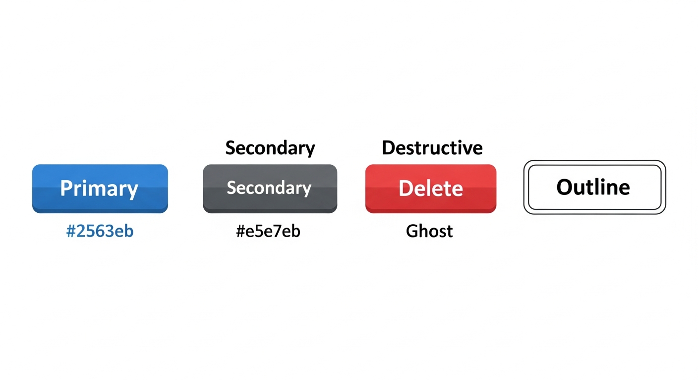
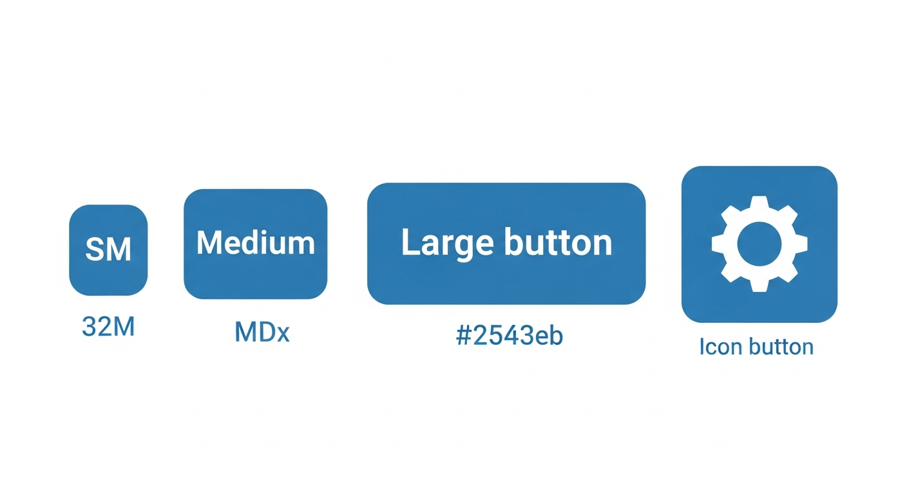
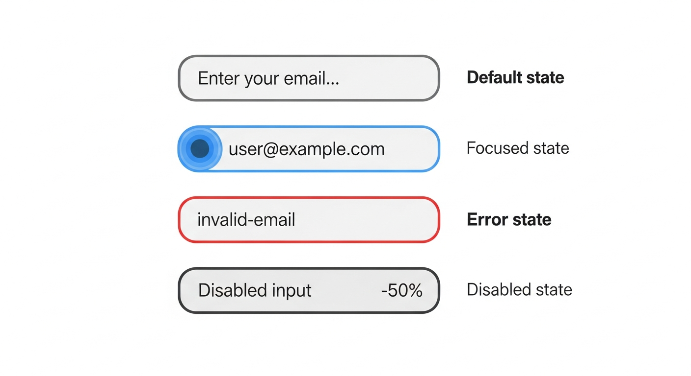
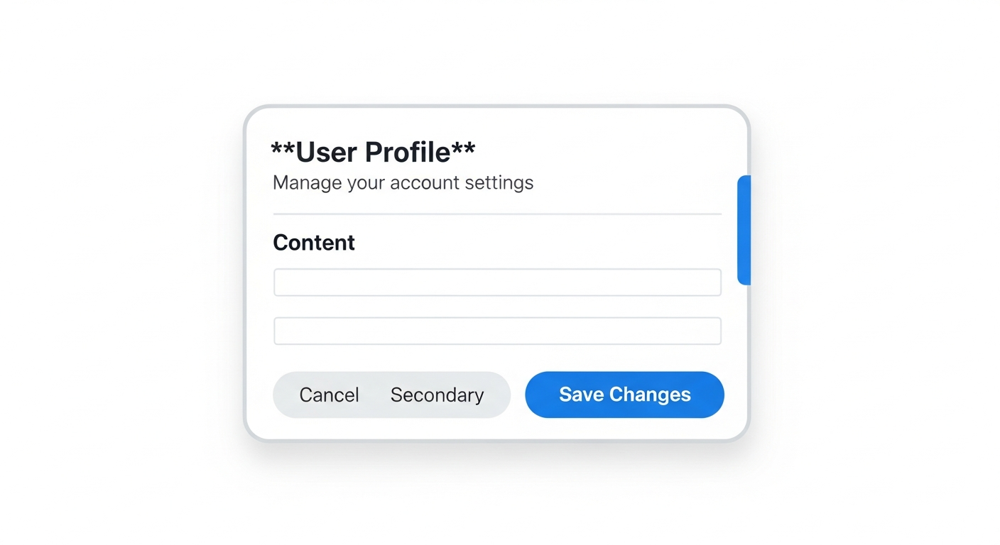
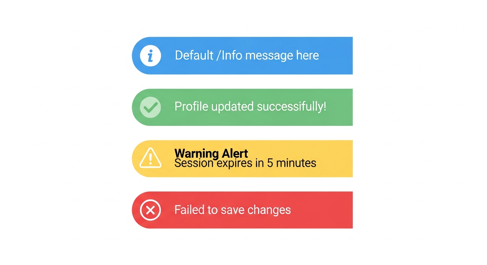
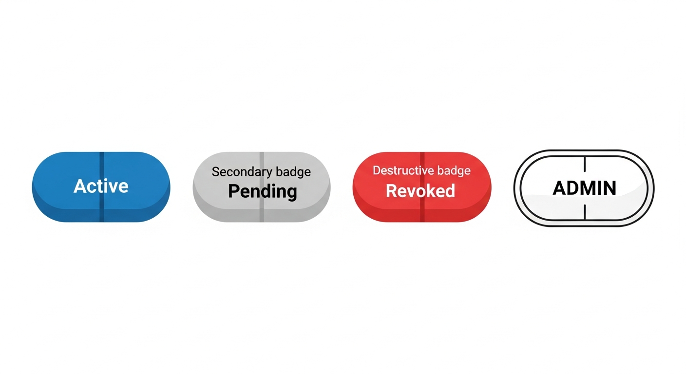
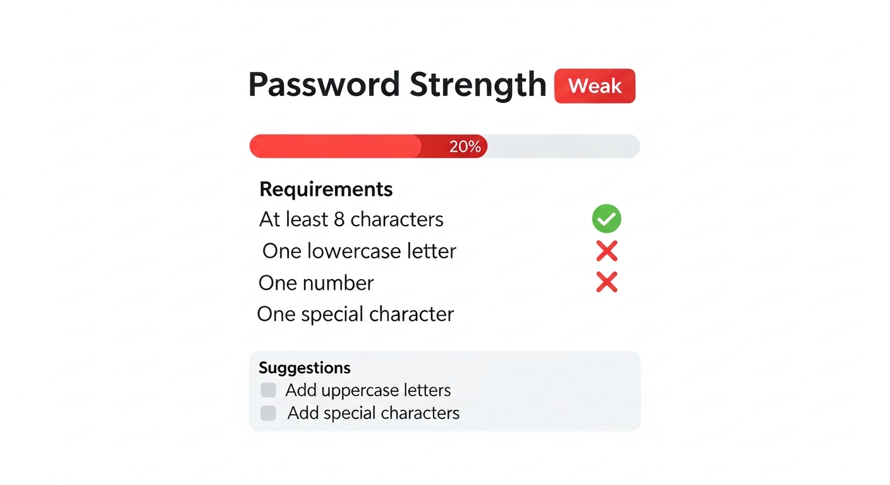
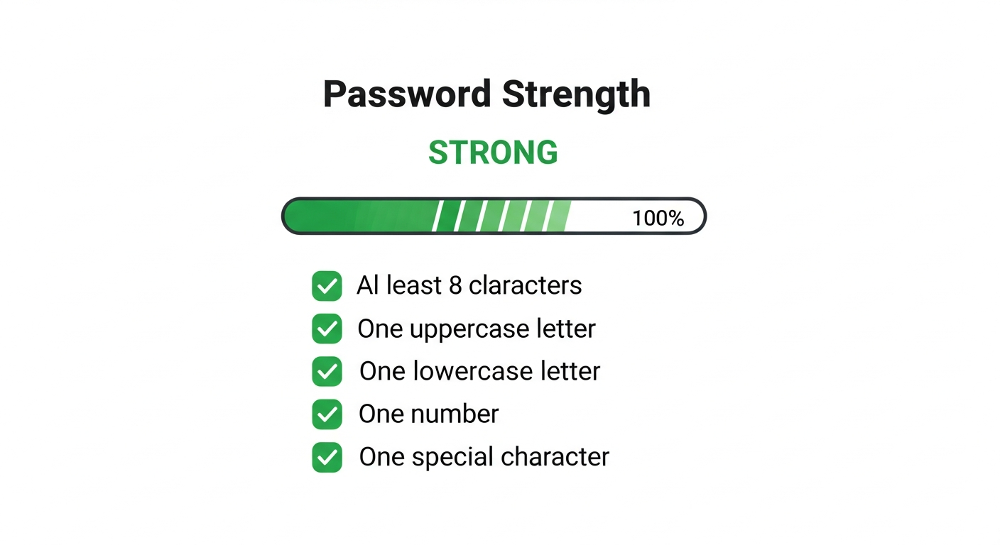

# Component Catalog

Visual reference for all UI components in the design system.

Source: [`src/components/ui/`](https://github.com/lbijeau/soclestack/tree/master/src/components/ui)

## Quick Reference

### UI Components

| Component | Variants | Sizes | Use Case |
|-----------|----------|-------|----------|
| [Button](#button) | primary, secondary, destructive, ghost, outline | sm, md, lg, icon | Actions and navigation |
| [Input](#input) | default, error | - | Form text input |
| [Card](#card) | - | - | Content containers |
| [Alert](#alert) | default, success, warning, error | - | Status messages |
| [Badge](#badge) | default, secondary, destructive, outline | - | Status labels |
| [PasswordStrengthMeter](#passwordstrengthmeter) | - | - | Password validation |
| [FieldError](#fielderror) | - | - | Form validation errors |

### SDK Components

| Component | Use Case | Package |
|-----------|----------|---------|
| [ProtectedRoute](#protectedroute) | Protect pages from unauthenticated users | `@soclestack/react` |
| [Can](#can) | Role-based UI visibility | `@soclestack/react` |
| [OrganizationSwitcher](#organizationswitcher) | Multi-tenant org switching | `@soclestack/react` |
| [InviteAccept](#inviteaccept) | Handle invite tokens | `@soclestack/react` |
| [SessionTimeoutWarning](#sessiontimeoutwarning) | Warn before session expires | `@soclestack/react` |
| [LoadingSpinner](#loadingspinner) | Loading indicator | `@soclestack/react` |
| [AccessDenied](#accessdenied) | Access denied page | `@soclestack/react` |

---

## Button

Versatile button component for actions and navigation.

**When to use:**
- `primary`: Main action on page (Submit, Save, Confirm)
- `secondary`: Cancel, Back, or less important actions
- `destructive`: Delete, Remove, or irreversible actions
- `ghost`: Subtle actions, toolbar buttons, or icon-only buttons
- `outline`: Alternative to secondary when more visual weight is needed

### Props

| Prop | Type | Default | Description |
|------|------|---------|-------------|
| `variant` | `'primary' \| 'secondary' \| 'destructive' \| 'ghost' \| 'outline'` | `'primary'` | Visual style |
| `size` | `'sm' \| 'md' \| 'lg' \| 'icon'` | `'md'` | Button size |
| `disabled` | `boolean` | `false` | Disabled state |
| `className` | `string` | - | Additional CSS classes |

### Variants



### Sizes



### Usage

```tsx
import { Button } from '@/components/ui/button';

// Primary action
<Button onClick={handleSubmit}>Save Changes</Button>

// Secondary action
<Button variant="secondary">Cancel</Button>

// Destructive action
<Button variant="destructive">Delete Account</Button>

// Icon button
<Button variant="ghost" size="icon">
  <Settings className="h-4 w-4" />
</Button>

// Loading state
<Button disabled>
  <Loader className="mr-2 h-4 w-4 animate-spin" />
  Saving...
</Button>
```

### Accessibility

- Focus ring visible on keyboard navigation
- Disabled state prevents interaction and shows visual feedback
- Supports `aria-label` for icon-only buttons

---

## Input

Form input component with error state support.

### Props

| Prop | Type | Default | Description |
|------|------|---------|-------------|
| `error` | `boolean` | `false` | Shows error styling |
| `type` | `string` | `'text'` | Input type (text, email, password, etc.) |
| `placeholder` | `string` | - | Placeholder text |
| `disabled` | `boolean` | `false` | Disabled state |

### States



### Usage

```tsx
import { Input } from '@/components/ui/input';

// Basic input
<Input
  type="email"
  placeholder="Enter your email"
  value={email}
  onChange={(e) => setEmail(e.target.value)}
/>

// With error state
<Input
  type="password"
  error={!!errors.password}
  aria-describedby="password-error"
/>

// Disabled
<Input disabled value="Cannot edit" />
```

### Accessibility

- Supports `aria-invalid` (auto-set when `error` is true)
- Use `aria-describedby` to link to error messages
- Focus states clearly visible

---

## Card

Container component for grouped content with header/body structure.

### Sub-components

| Component | Purpose |
|-----------|---------|
| `Card` | Outer container with border and shadow |
| `CardHeader` | Header section with spacing |
| `CardTitle` | Main heading (h3) |
| `CardDescription` | Subtitle text |
| `CardContent` | Main content area |
| `CardFooter` | Footer with actions |

### Structure



### Usage

```tsx
import {
  Card,
  CardContent,
  CardDescription,
  CardFooter,
  CardHeader,
  CardTitle,
} from '@/components/ui/card';

<Card>
  <CardHeader>
    <CardTitle>Account Settings</CardTitle>
    <CardDescription>Update your profile information</CardDescription>
  </CardHeader>
  <CardContent>
    <form>
      <Input placeholder="Name" />
      <Input placeholder="Email" />
    </form>
  </CardContent>
  <CardFooter>
    <Button variant="secondary">Cancel</Button>
    <Button>Save</Button>
  </CardFooter>
</Card>
```

---

## Alert

Status message component with icon and color variants.

**When to use:**
- `default`: General information, tips, or neutral messages
- `success`: Confirmation of completed actions
- `warning`: Caution about potential issues or expiring states
- `error`: Failed actions or validation errors requiring attention

### Props

| Prop | Type | Default | Description |
|------|------|---------|-------------|
| `variant` | `'default' \| 'success' \| 'warning' \| 'error'` | `'default'` | Alert type |
| `children` | `ReactNode` | - | Alert content |

### Variants



### Usage

```tsx
import { Alert } from '@/components/ui/alert';

// Success message
<Alert variant="success">
  Your password has been changed successfully.
</Alert>

// Error message
<Alert variant="error">
  Invalid credentials. Please try again.
</Alert>

// Warning
<Alert variant="warning">
  Your account will be locked after 3 more failed attempts.
</Alert>

// Information
<Alert variant="default">
  Two-factor authentication is recommended.
</Alert>
```

### Accessibility

- Uses `role="alert"` for error/warning variants
- Uses `aria-live="assertive"` for errors, `aria-live="polite"` for others
- Icons are decorative (`aria-hidden="true"`)

---

## Badge

Small status indicator labels.

**When to use:**
- `default`: Active or positive states (Active, Enabled, Online)
- `secondary`: Neutral or pending states (Pending, Draft, Idle)
- `destructive`: Negative states (Expired, Revoked, Inactive)
- `outline`: Labels or categories (role badges, tags)

### Props

| Prop | Type | Default | Description |
|------|------|---------|-------------|
| `variant` | `'default' \| 'secondary' \| 'destructive' \| 'outline'` | `'default'` | Badge style |

### Variants



### Usage

```tsx
import { Badge } from '@/components/ui/badge';

// Status indicators
<Badge>Active</Badge>
<Badge variant="secondary">Pending</Badge>
<Badge variant="destructive">Expired</Badge>

// Role badges
<Badge variant="outline">{user.role}</Badge>

// In tables
<td>
  <Badge variant={key.revokedAt ? 'destructive' : 'default'}>
    {key.revokedAt ? 'Revoked' : 'Active'}
  </Badge>
</td>
```

---

## PasswordStrengthMeter

Visual password strength indicator with requirements checklist.

### Props

| Prop | Type | Default | Description |
|------|------|---------|-------------|
| `password` | `string` | - | Password to evaluate |
| `showRequirements` | `boolean` | `true` | Show requirements checklist |
| `showSuggestions` | `boolean` | `true` | Show improvement suggestions |

### Visual States

**Weak Password:**



**Strong Password:**



### Usage

```tsx
import { PasswordStrengthMeter } from '@/components/ui/password-strength-meter';

// Full display
<PasswordStrengthMeter password={password} />

// Minimal (just the bar)
<PasswordStrengthMeter
  password={password}
  showRequirements={false}
  showSuggestions={false}
/>
```

---

## FieldError

Form field error message display.

### Props

| Prop | Type | Default | Description |
|------|------|---------|-------------|
| `id` | `string` | - | ID for `aria-describedby` linking |
| `error` | `string[]` | - | Array of error messages (displays first) |

### Usage

```tsx
import { FieldError } from '@/components/ui/field-error';

<div>
  <label htmlFor="email">Email</label>
  <Input
    id="email"
    error={!!errors.email}
    aria-describedby="email-error"
  />
  <FieldError id="email-error" error={errors.email} />
</div>
```

### Accessibility

- Uses `role="alert"` for screen reader announcement
- Uses `aria-atomic="true"` to announce entire message

---

## Design Tokens

### Colors

| Token | Hex | Usage |
|-------|-----|-------|
| Primary | `#2563eb` (blue-600) | Primary actions |
| Secondary | `#e5e7eb` (gray-200) | Secondary actions |
| Destructive | `#dc2626` (red-600) | Destructive actions |
| Success | `#16a34a` (green-600) | Success states |
| Warning | `#ca8a04` (yellow-600) | Warning states |
| Error | `#dc2626` (red-600) | Error states |

### Spacing

| Size | Value | Usage |
|------|-------|-------|
| sm | `h-8`, `px-3` | Compact buttons |
| md | `h-10`, `px-4` | Default size |
| lg | `h-12`, `px-6` | Large buttons |

### Border Radius

All components use `rounded-md` (0.375rem / 6px) for consistency. Badges use `rounded-full` for pill shape.

---

---

## SDK Components

Components from `@soclestack/react` for common authentication patterns.

### ProtectedRoute

Protects routes from unauthenticated users with optional role requirements.

**Props:**

| Prop | Type | Default | Description |
|------|------|---------|-------------|
| `children` | `ReactNode` | required | Content to protect |
| `roles` | `string[]` | - | Required roles (any match) |
| `fallback` | `ReactNode` | `<LoadingSpinner />` | Loading state |
| `accessDeniedFallback` | `ReactNode` | `<AccessDenied />` | Role check failed |

```tsx
import { ProtectedRoute } from '@soclestack/react';

// Basic protection
<ProtectedRoute>
  <Dashboard />
</ProtectedRoute>

// With role requirement
<ProtectedRoute roles={['ROLE_ADMIN']}>
  <AdminPanel />
</ProtectedRoute>
```

---

### Can

Conditionally renders children based on user roles or organization permissions.

**Props:**

| Prop | Type | Default | Description |
|------|------|---------|-------------|
| `children` | `ReactNode` | required | Content to show if authorized |
| `roles` | `string[]` | - | Global user roles |
| `orgRoles` | `string[]` | - | Organization roles |
| `fallback` | `ReactNode` | `null` | Content if unauthorized |

```tsx
import { Can } from '@soclestack/react';

// Show only to admins
<Can roles={['ROLE_ADMIN']}>
  <DeleteButton />
</Can>

// With fallback
<Can roles={['ROLE_ADMIN']} fallback={<UpgradePrompt />}>
  <PremiumFeature />
</Can>

// Organization roles
<Can orgRoles={['ROLE_OWNER', 'ROLE_ADMIN']}>
  <TeamSettings />
</Can>
```

---

### OrganizationSwitcher

Dropdown for switching between organizations in multi-tenant apps.

**Props:**

| Prop | Type | Default | Description |
|------|------|---------|-------------|
| `trigger` | `ReactNode` | Default button | Custom trigger element |
| `onSwitch` | `(org: Organization) => void` | - | Called after switching |
| `showCreateLink` | `boolean` | `false` | Show create org link |
| `createOrgUrl` | `string` | `/organizations/new` | URL for create link |

```tsx
import { OrganizationSwitcher } from '@soclestack/react';

// Basic usage
<OrganizationSwitcher />

// With callback
<OrganizationSwitcher
  onSwitch={(org) => router.push(`/org/${org.slug}`)}
  showCreateLink
/>
```

---

### InviteAccept

Handles organization invite token validation and acceptance.

**Props:**

| Prop | Type | Default | Description |
|------|------|---------|-------------|
| `token` | `string` | required | Invite token from URL |
| `onAccepted` | `(org: Organization) => void` | - | Called after accepting |
| `onError` | `(error: Error) => void` | - | Called on error |
| `loginUrl` | `string` | `/login` | Login page URL |
| `returnUrl` | `string` | - | Post-login redirect |

**States:**

| Status | Visual |
|--------|--------|
| `loading` | Spinner |
| `valid` | Invite details + Accept button |
| `expired` | Error message |
| `invalid` | Error message |

```tsx
import { InviteAccept } from '@soclestack/react';

<InviteAccept
  token={params.token}
  onAccepted={(org) => router.push(`/org/${org.slug}`)}
  onError={(error) => toast.error(error.message)}
/>
```

---

### SessionTimeoutWarning

Modal that warns users before their session expires.

**Props:**

| Prop | Type | Default | Description |
|------|------|---------|-------------|
| `warnBefore` | `number` | `300` | Seconds before expiry to warn |
| `checkInterval` | `number` | `30` | Check frequency (seconds) |
| `onWarning` | `() => void` | - | Called when warning shown |
| `onTimeout` | `() => void` | - | Called when session expires |
| `onExtend` | `() => void` | - | Called after extend success |
| `onLogout` | `() => void` | - | Called on logout click |
| `title` | `string` | `"Session Expiring"` | Modal title |
| `extendLabel` | `string` | `"Stay Signed In"` | Extend button text |
| `logoutLabel` | `string` | `"Log Out"` | Logout button text |

```tsx
import { SessionTimeoutWarning } from '@soclestack/react';

// Basic - add to root layout
<SessionTimeoutWarning />

// With callbacks
<SessionTimeoutWarning
  warnBefore={300}
  onTimeout={() => router.push('/login?expired=true')}
  onExtend={() => toast.success('Session extended')}
/>
```

---

### LoadingSpinner

Default loading indicator used by SDK components.

**Props:**

| Prop | Type | Default | Description |
|------|------|---------|-------------|
| `size` | `number` | `24` | Size in pixels |
| `className` | `string` | - | Additional CSS |

```tsx
import { LoadingSpinner } from '@soclestack/react';

<LoadingSpinner />
<LoadingSpinner size={32} className="text-blue-500" />
```

---

### AccessDenied

Default access denied page shown by ProtectedRoute.

**Props:**

| Prop | Type | Default | Description |
|------|------|---------|-------------|
| `title` | `string` | `"Access Denied"` | Heading |
| `message` | `string` | (default) | Description text |

```tsx
import { AccessDenied } from '@soclestack/react';

<AccessDenied
  title="Permission Required"
  message="You need admin access to view this page."
/>
```

---

## Related Documentation

- [SDK Recipes Guide](../SDK_RECIPES.md)
- [UI Components Source](https://github.com/lbijeau/soclestack/blob/master/src/components/ui/README.md)
- [Auth Components](https://github.com/lbijeau/soclestack/blob/master/src/components/auth/README.md)
- [Profile Components](https://github.com/lbijeau/soclestack/blob/master/src/components/profile/README.md)
- [Technical Architecture](../TECHNICAL_ARCHITECTURE.md)
