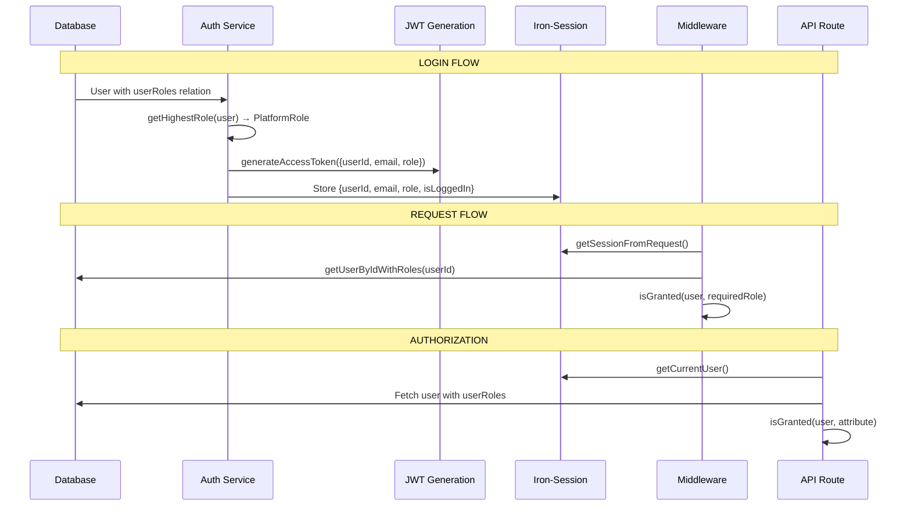

# Spike: Arbitrary Role Support in JWT Validation

**Date:** 2026-01-04
**Issue:** #182
**Author:** Claude (AI Assistant)
**Status:** Research Complete

## Executive Summary

The SocleStack RBAC system is designed for database-driven role management with hierarchical inheritance (Symfony-style). However, JWT token validation currently hardcodes three base roles, creating a bottleneck for extensibility. This spike explores approaches to enable arbitrary role support while maintaining security guarantees.

**Recommendation:** Approach D (Hybrid - validate structure, not values) provides the best balance of security, performance, and extensibility. It requires minimal changes, maintains backward compatibility, and aligns with the existing authorization model.

---

## Current Architecture Analysis

### Role Storage and Hierarchy

Roles are stored in the `Role` table with parent-child relationships:

```
ROLE_USER (base)
  └── ROLE_MODERATOR
      └── ROLE_ADMIN
```

**Database Schema:**
```prisma
model Role {
  id          String   @id @default(cuid())
  name        String   @unique  // "ROLE_USER", "ROLE_ADMIN", etc.
  description String?
  parentId    String?           // Parent role for hierarchy
  isSystem    Boolean  @default(false)
  // ... timestamps
}

model UserRole {
  userId    String
  roleId    String
  // ... user-role junction
}
```

### Current Role Flow



### The Bottleneck: JWT Validation

**File:** `src/lib/security.ts`

```typescript
// Lines 7-11: Hardcoded valid roles
const VALID_ROLES: PlatformRole[] = [
  'ROLE_USER',
  'ROLE_MODERATOR',
  'ROLE_ADMIN',
];

// Lines 13-28: Validation function
function isValidAccessTokenPayload(payload: JoseJWTPayload): boolean {
  return (
    typeof payload.sub === 'string' &&
    typeof payload.email === 'string' &&
    typeof payload.role === 'string' &&
    VALID_ROLES.includes(payload.role as PlatformRole) &&  // <-- BOTTLENECK
    typeof payload.jti === 'string'
  );
}
```

**Impact:** Adding a new role (e.g., `ROLE_BILLING_ADMIN`) requires:
1. Code change to `VALID_ROLES` array
2. Type update to `PlatformRole` union
3. Deployment

This contradicts the database-driven design philosophy.

### Current JWT Usage

| Context | Uses JWT? | Uses Session? | Notes |
|---------|-----------|---------------|-------|
| API Routes | Tokens returned, rarely validated | Primary auth via `getCurrentUser()` | Session-first architecture |
| Middleware | No direct JWT use | `getSessionFromRequest()` | Role checks via `isGranted()` |
| Token Refresh | `verifyRefreshToken()` | Fetches fresh user from DB | Re-generates token with current role |
| API Keys | Bearer token (not JWT) | N/A | Separate auth path |

**Key Insight:** The codebase uses session-based authentication as the primary mechanism. JWTs are generated and returned but rarely directly validated for authorization. The `isGranted()` function always resolves roles from the database.

---

## Approach Evaluation

### Approach A: JWT Stores Role ID, Resolve Server-Side

**Description:** Store the role's database ID (UUID) in the JWT instead of the role name. On each request, resolve the role name from the database.

**Implementation:**
```typescript
// Token generation
const accessToken = await generateAccessToken({
  userId: user.id,
  email: user.email,
  roleId: user.userRoles[0].roleId,  // UUID instead of name
});

// Token validation
async function verifyAccessToken(token: string) {
  const { payload } = await jwtVerify(token, getJwtSecret(), {...});
  const role = await prisma.role.findUnique({ where: { id: payload.roleId } });
  if (!role) throw new Error('Invalid role');
  return { ...payload, role: role.name };
}
```

| Criterion | Score | Notes |
|-----------|-------|-------|
| Security | HIGH | Role validity always verified against DB |
| Performance | LOW | DB query on every JWT verification |
| Complexity | MEDIUM | Requires role lookup caching |
| Migration | HIGH | Breaking change to JWT structure |
| Flexibility | HIGH | Any role works immediately |

**Pros:**
- Roles deleted from DB automatically invalidate tokens
- No code changes needed for new roles
- Single source of truth (database)

**Cons:**
- Additional DB query per request (can be cached)
- Breaking change for existing tokens
- UUID in token is opaque, harder to debug
- Requires cache invalidation strategy

### Approach B: JWT Stores Array of Role Names, Validate Dynamically

**Description:** Store all user roles in the JWT as an array. Validate that at least one role exists in the database.

**Implementation:**
```typescript
// Token generation
const accessToken = await generateAccessToken({
  userId: user.id,
  email: user.email,
  roles: user.userRoles.map(ur => ur.role.name),  // Array
});

// Token validation
async function isValidAccessTokenPayload(payload) {
  const validRoles = await getValidRoleNames();  // Cached DB query
  return payload.roles.some(role => validRoles.includes(role));
}
```

| Criterion | Score | Notes |
|-----------|-------|-------|
| Security | MEDIUM | Requires cache of valid roles |
| Performance | MEDIUM | Cached role list lookup |
| Complexity | HIGH | Array handling, cache management |
| Migration | HIGH | Token structure change |
| Flexibility | HIGH | Supports multiple roles per user |

**Pros:**
- Supports future multi-role assignments
- Token is self-descriptive
- Can check inheritance without DB query

**Cons:**
- Larger token size (multiple roles in payload)
- Role cache must be invalidated when roles change
- More complex validation logic
- Stale tokens may reference deleted roles

### Approach C: Remove JWT Role Validation Entirely

**Description:** JWT contains only user ID. All role information comes from session/database at request time.

**Implementation:**
```typescript
// Simplified token generation
const accessToken = await generateAccessToken({
  userId: user.id,
  email: user.email,
  // No role in token
});

// All authorization via session
const user = await getCurrentUser();  // Already fetches roles from DB
const canAccess = await isGranted(user, 'ROLE_ADMIN');
```

| Criterion | Score | Notes |
|-----------|-------|-------|
| Security | HIGH | Always fresh from DB |
| Performance | HIGH | No extra validation overhead |
| Complexity | LOW | Simpler tokens |
| Migration | MEDIUM | Remove role from type definitions |
| Flexibility | HIGH | Complete database control |

**Pros:**
- Simplest approach
- Aligns with current session-first architecture
- Role changes take effect immediately
- No cache invalidation needed

**Cons:**
- Loses ability for stateless JWT verification
- Token less useful for microservices/external APIs
- Can't determine user role from token alone

### Approach D: Hybrid - Validate Structure, Not Values (Recommended)

**Description:** JWT validation ensures the role field matches the `ROLE_*` pattern (structural validation). Actual role validity is checked via `isGranted()` at runtime against the database.

**Implementation:**
```typescript
// Updated validation - pattern-based instead of whitelist
function isValidAccessTokenPayload(payload: JoseJWTPayload): boolean {
  return (
    typeof payload.sub === 'string' &&
    typeof payload.email === 'string' &&
    typeof payload.role === 'string' &&
    /^ROLE_[A-Z_]+$/.test(payload.role) &&  // Pattern validation
    typeof payload.jti === 'string'
  );
}

// Authorization still uses isGranted (unchanged)
const canAccess = await isGranted(user, 'ROLE_BILLING_ADMIN');  // DB lookup
```

| Criterion | Score | Notes |
|-----------|-------|-------|
| Security | HIGH | Structural + runtime validation |
| Performance | HIGH | No additional DB queries |
| Complexity | LOW | Minimal code change |
| Migration | LOW | Backward compatible |
| Flexibility | HIGH | New roles work without code changes |

**Pros:**
- Minimal change (one regex instead of array check)
- Backward compatible with existing tokens
- New roles work immediately after DB insert
- Maintains separation: JWT validates structure, `isGranted()` validates authorization
- No cache management needed

**Cons:**
- A token with an invalid/deleted role passes JWT validation
- Role validity not confirmed until authorization check
- Potential for confusion if role is in token but not in DB

---

## Security Considerations

### Token Forgery Risk

All approaches maintain cryptographic integrity via HMAC-SHA256 signing. An attacker cannot forge a valid token without the secret key.

### Role Elevation Risk

| Approach | Risk Level | Mitigation |
|----------|------------|------------|
| A (ID lookup) | Very Low | Role must exist in DB |
| B (Array + cache) | Low | Cache must include role |
| C (No role) | None | No role in token |
| D (Pattern) | Low | `isGranted()` validates against DB |

**Approach D Analysis:** An attacker with a valid token could modify the role claim (if they had the signing key, which they don't). Without the key, any modification invalidates the signature. The pattern validation prevents injection attacks (e.g., role containing SQL or script).

### Token Lifetime Concerns

Current token lifetime: 15 minutes (access), 7 days (refresh)

If a role is deleted:
- **Approach A:** Token immediately invalid
- **Approach B:** Token invalid after cache refresh
- **Approach C:** No impact (role not in token)
- **Approach D:** Token structurally valid, but `isGranted()` returns false

For Approach D, this is acceptable because:
1. Access tokens are short-lived (15 min)
2. Authorization always checks `isGranted()` which queries DB
3. Refresh token flow fetches fresh roles from DB

---

## Performance Analysis

### Current Flow (Baseline)
```
Request → Session lookup (iron-session decrypt) → DB query for user+roles → isGranted check
```

### Approach D Impact
```
Request → Session lookup → DB query for user+roles → isGranted check
```

**No additional overhead.** JWT validation with regex is O(1) and negligible compared to DB queries already being made.

### Comparison Table

| Approach | JWT Validation | Authorization | Total DB Queries |
|----------|----------------|---------------|------------------|
| Current | Array.includes() | 1 (user+roles) | 1 |
| A | 1 (role lookup) | 1 (user+roles) | 2 |
| B | 1 (role cache) | 1 (user+roles) | 1 + cache |
| C | None | 1 (user+roles) | 1 |
| D | Regex test | 1 (user+roles) | 1 |

---

## Recommendation: Approach D

### Rationale

1. **Minimal Change:** Single regex replacement in `isValidAccessTokenPayload()`
2. **Backward Compatible:** Existing tokens continue to work
3. **Aligned Architecture:** Leverages existing `isGranted()` for actual authorization
4. **No Cache Management:** Avoids complexity of role cache invalidation
5. **Future-Proof:** Supports arbitrary roles without code changes

### Implementation Roadmap

#### Phase 1: JWT Validation Update (Low Risk)

**Estimated effort:** 2 hours

1. Update `src/lib/security.ts`:
   ```typescript
   // Replace VALID_ROLES array check with pattern
   const ROLE_PATTERN = /^ROLE_[A-Z][A-Z0-9_]*$/;

   function isValidAccessTokenPayload(payload) {
     return (
       typeof payload.sub === 'string' &&
       typeof payload.email === 'string' &&
       typeof payload.role === 'string' &&
       ROLE_PATTERN.test(payload.role) &&
       typeof payload.jti === 'string'
     );
   }
   ```

2. Update `src/types/auth.ts`:
   ```typescript
   // Change from union to pattern-based type
   export type PlatformRole = `ROLE_${string}`;
   ```

3. Update tests to cover new pattern validation

#### Phase 2: Type System Updates (Medium Risk)

**Estimated effort:** 4 hours

1. Audit all uses of `PlatformRole` type
2. Update components that rely on exhaustive role checks
3. Consider branded types for compile-time safety

#### Phase 3: Documentation and Admin UI (Low Risk)

**Estimated effort:** 2 hours

1. Document the arbitrary role capability
2. Update admin role management UI to show the pattern requirement
3. Add validation in role creation form

### Files to Modify

| File | Change |
|------|--------|
| `src/lib/security.ts` | Replace `VALID_ROLES` with regex pattern |
| `src/types/auth.ts` | Update `PlatformRole` type definition |
| `src/lib/security/client.ts` | Update client-side role hierarchy if needed |
| `prisma/seed.ts` | No change (already uses `ROLES` constants) |

### Testing Strategy

1. **Unit Tests:**
   - JWT validation accepts valid patterns (`ROLE_ADMIN`, `ROLE_BILLING_ADMIN`)
   - JWT validation rejects invalid patterns (`admin`, `ROLE-ADMIN`, `ROLE_123`)
   - Token generation/verification roundtrip with custom roles

2. **Integration Tests:**
   - Create new role in DB, assign to user, verify access
   - Delete role from DB, verify access denied
   - Existing tokens continue to work

3. **E2E Tests:**
   - Login with custom role user
   - Middleware correctly routes based on `isGranted()`

---

## Alternative Considerations

### Why Not Remove JWT Roles Entirely (Approach C)?

While simpler, removing roles from JWTs would:
- Break potential future microservices integration
- Lose the ability for external services to decode role from token
- Make debugging harder (can't see role in token payload)

### Why Not Full Dynamic Validation (Approach A)?

The additional DB query per request is unnecessary given:
- Session already provides user context
- `isGranted()` already queries DB for role hierarchy
- Access tokens are short-lived (15 min)

---

## Appendix: Code References

### JWT Generation
- `src/lib/security.ts:114-133` - `generateAccessToken()`

### JWT Validation
- `src/lib/security.ts:13-28` - `isValidAccessTokenPayload()`
- `src/lib/security.ts:152-174` - `verifyAccessToken()`

### Session Management
- `src/lib/auth.ts:60-62` - `getSession()`
- `src/lib/auth.ts:326-377` - `createUserSession()`

### RBAC Authorization
- `src/lib/security/index.ts:74-142` - `isGranted()`
- `src/lib/security/index.ts:150-161` - `hasRole()`
- `src/lib/security/index.ts:207-262` - `getRoleHierarchy()`

### Middleware
- `src/middleware.ts:186` - `isGranted(user, requiredRole)`

---

## Conclusion

The current hardcoded `VALID_ROLES` array is the sole bottleneck preventing arbitrary role support. The recommended Approach D (pattern validation) provides a clean, minimal-risk path to database-driven role extensibility while maintaining the security guarantees of the existing system.

The existing `isGranted()` function already provides robust, database-driven authorization. By relaxing JWT validation to structural checks only, we complete the "database-driven roles" story without introducing performance overhead or complex cache management.
